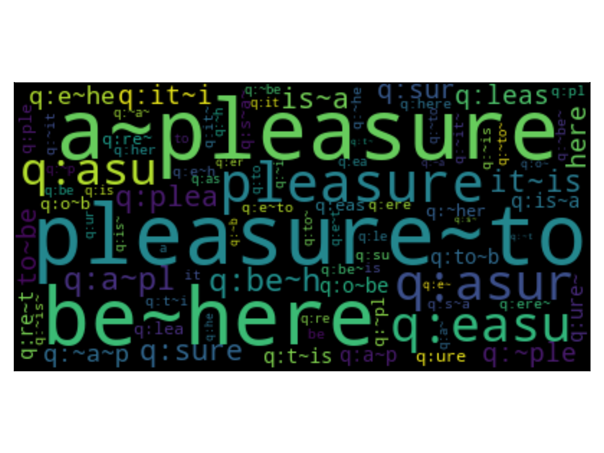
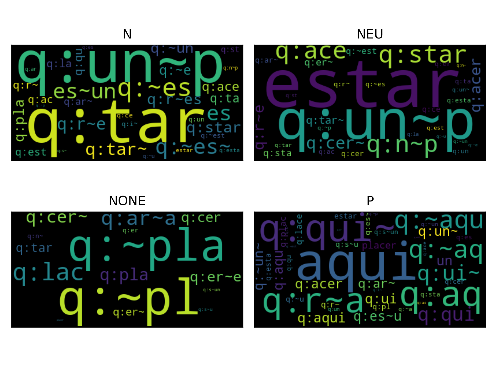

.. _BoW:

====================================
:py:class:`BoW`
====================================
.. image:: https://github.com/INGEOTEC/EvoMSA/actions/workflows/test.yaml/badge.svg
		:target: https://github.com/INGEOTEC/EvoMSA/actions/workflows/test.yaml

.. image:: https://coveralls.io/repos/github/INGEOTEC/EvoMSA/badge.svg?branch=develop
		:target: https://coveralls.io/github/INGEOTEC/EvoMSA?branch=develop

.. image:: https://badge.fury.io/py/EvoMSA.svg
		:target: https://badge.fury.io/py/EvoMSA

.. image:: https://dev.azure.com/conda-forge/feedstock-builds/_apis/build/status/evomsa-feedstock?branchName=main
	    :target: https://dev.azure.com/conda-forge/feedstock-builds/_build/latest?definitionId=16466&branchName=main

.. image:: https://img.shields.io/conda/vn/conda-forge/evomsa.svg
		:target: https://anaconda.org/conda-forge/evomsa

.. image:: https://img.shields.io/conda/pn/conda-forge/evomsa.svg
		:target: https://anaconda.org/conda-forge/evomsa

.. image:: https://readthedocs.org/projects/evomsa/badge/?version=docs
		:target: https://evomsa.readthedocs.io/en/docs/?badge=docs

:ref:`BoW` is a text classifier :math:`c` with signature :math:`c \equiv g \circ m`, where :math:`m` stands for the BoW representation and :math:`g` is the classifier (the default is a linear Support Vector Machine).

The classifier :math:`g` is trained on a dataset :math:`\mathcal D` of pairs (:math:`x`, :math:`y`), where :math:`x` is a text and :math:`y` is the label associated with it. The BoW representation :math:`m` is either a pre-trained model or a model trained on :math:`\mathcal D`, both used the Term Frequency Inverse Document Frequency (TFIDF) as a weighting scheme. 

The BoW representation used is described in "`A Simple Approach to Multilingual Polarity Classification in Twitter <https://www.sciencedirect.com/science/article/abs/pii/S0167865517301721>`_. Eric S. Tellez, Sabino Miranda-Jiménez, Mario Graff, Daniela Moctezuma, Ranyart R. Suárez, Oscar S. Siordia. Pattern Recognition Letters" and "`An Automated Text Categorization Framework based on Hyperparameter Optimization <https://www.sciencedirect.com/science/article/abs/pii/S0950705118301217>`_. Eric S. Tellez, Daniela Moctezuma, Sabino Miranda-Jímenez, Mario Graff. Knowledge-Based Systems Volume 149, 1 June 2018."

Bag of Words Representation
--------------------------------

The core idea of a BoW model is that after the text is normalized and tokenized, each token :math:`t` is associated with a vector :math:`\mathbf{v_t} \in \mathbb R^d` where the :math:`i`-th component, i.e., :math:`\mathbf{v_t}_i`, contains the IDF value of the token :math:`t` and :math:`\forall_{j \neq i} \mathbf{v_t}_j=0`. The set of vectors :math:`\mathbf v` corresponds to the vocabulary, there are :math:`d` different tokens in the vocabulary, and by definition :math:`\forall_{i \neq j} \mathbf{v_i} \cdot \mathbf{v_j} = 0`, where :math:`\mathbf{v_i} \in \mathbb R^d`, :math:`\mathbf{v_j} \in \mathbb R^d`, and :math:`(\cdot)` is the dot product. It is worth mentioning that any token outside the vocabulary is discarded.

Using this notation, a text :math:`x` is represented by the sequence of its tokens, i.e., :math:`(t_1, t_2, \ldots)`; the sequence can have repeated tokens, e.g., :math:`t_j = t_k`. Then each token is associated with its respective vector :math:`\mathbf v` (keeping the repetitions), i.e., :math:`(\mathbf{v_{t_1}}, \mathbf{v_{t_2}}, \ldots)`. Finally, the text :math:`x` is represented as: 

.. math:: 
	\mathbf x = \frac{\sum_t \mathbf{v_t}}{\lVert \sum_t \mathbf{v_t} \rVert},

where the sum goes for all the elements of the sequence, :math:`\mathbf x \in \mathbb R^d`, and :math:`\lVert \mathbf w \rVert` is the Euclidean norm of vector :math:`\mathbf w.` The term frequency is implicitly computed in the sum because the process allows token repetitions.

Parameters
^^^^^^^^^^^^^^^^^^^^^^^^^^^^^^^^

Different BoW representations were created and implemented following the approach mentioned above. The first step was to set all the characters to lowercase and remove diacritics and punctuation symbols. Additionally, the users and the URLs were removed from the text. Once normalized, the text is split into bigrams, words, and q-grams of characters with :math:`q=\{2, 3, 4\}`, except for Japanese and Chinese that do not use neither words or bigrams, and the q-grams are :math:`q=\{1, 2, 3\}`

The pre-trained BoW (i.e., :py:attr:`pretrain` parameter) is estimated from 4,194,304 (:math:`2^{22}`) tweets randomly selected. The IDF values were estimated from the collections, and some tokens were selected from all the available ones found in the collection. Two procedures were used to select the tokens; the first corresponds to selecting the :math:`d` tokens with the highest frequency (parameter :py:attr:`voc_selection` set to :py:attr:`most_common`), and the other to normalize the frequency w.r.t. their type, i.e., bigrams, words, and q-grams of characters (parameter :py:attr:`voc_selection` set to :py:attr:`most_common_by_type` - default). Once the frequency is normalized, one selects the :math:`d` tokens with the highest normalized frequency. The value of :math:`\log_2 d` (parameter :py:attr:`voc_size_exponent`) by default is :math:`17`, representing a vocabulary of :math:`2^{17}` tokens; however, other valid values are :math:`13, 14, \ldots, 17`. It is also possible to train the BoW model using the training set; in this case, we used the default parameters, setting the parameter :py:attr:`pretrain` to false.

The default parameters for the BoW representation can be obtained using the following code. 

.. code-block:: python

    >>> from EvoMSA.utils import b4msa_params
    >>> b4msa_params(lang='es')
    {'num_option': 'none',
     'usr_option': 'delete',
     'url_option': 'delete',
     'emo_option': 'none',
     'hashtag_option': 'none',
     'ent_option': 'none',
     'lc': True,
     'del_dup': False,
     'del_punc': True,
     'del_diac': True,
     'select_ent': False,
     'select_suff': False,
     'select_conn': False,
     'max_dimension': True,
     'unit_vector': True,
     'token_max_filter': 32768,
     'token_list': [-2, -1, 2, 3, 4]}

The two procedures used to select the tokens create different vocabularies. The following table presents the Jaccard index between the vocabularies created when the vocabulary size is :math:`\mathbb 2^{13}` and :math:`\mathbb 2^{17}`. Roughly, the index is around 0.60 for the vocabulary size of :math:`2^{17}`, except for Japanese and Chinese, where the vocabulary is similar in the two procedures; this latter case results from the tokenizer's parameters.

.. list-table:: Jaccard index between the two token selection mechanisms.
    :header-rows: 1

    * - Language
      - Voc. Size :math:`\mathbb 2^{13}`
      - Voc. Size :math:`\mathbb 2^{17}`
    * - Arabic (ar)
      - 0.58
      - 0.58
    * - Catalan (ca)
      - 0.67
      - 0.57
    * - German (de)
      - 0.63
      - 0.57
    * - English (en)
      - 0.64
      - 0.58
    * - Spanish (es)
      - 0.62
      - 0.61
    * - French (fr)
      - 0.61
      - 0.62
    * - Hindi (hi)
      - 0.66
      - 0.58
    * - Indonesian (in)
      - 0.66
      - 0.56
    * - Italian (it)
      - 0.63
      - 0.61
    * - Japanese (ja)
      - 0.93
      - 0.97
    * - Korean (ko)
      - 0.62
      - 0.52
    * - Dutch (nl)
      - 0.62
      - 0.59
    * - Polish (pl)
      - 0.67 
      - 0.60
    * - Portuguese (pt)
      - 0.61
      - 0.65
    * - Russian (ru)
      - 0.67
      - 0.56
    * - Tagalog (tl)
      - 0.64
      - 0.58
    * - Turkish (tr)
      - 0.66
      - 0.55
    * - Chinese (zh)
      - 0.92
      - 0.97

Example
^^^^^^^^^^^^^^^^^^^^^^^^^^^^^^^^

This process is illustrated by representing the text *good morning* in the pre-trained bag-of-words model. The first step is to import and initialize the class :py:class:`BoW` as done in the following instructions.

>>> from EvoMSA import BoW
>>> bow = BoW(lang='en')

The method :py:attr:`BoW.transform` receives a list of text to be represented in the vector space of the bag of words. It returns a sparse matrix where the number of rows corresponds to the number of texts transformed and the columns are the vocabulary. The following instruction processes the text *good morning* and stored it in a variable :py:attr:`X`.

>>> X = bow.transform(['good morning'])
>>> X
<1x131072 sparse matrix of type '<class 'numpy.float64'>'
	with 39 stored elements in Compressed Sparse Row format>

The non-zero components are found in :py:attr:`X.indices`

>>> X.indices
array([29931, 30034, 46695, 66802, 67000, 67005, 71620, 71654, 71655,
       71945, 74474, 74550, 74574, 79178, 79237, 79242, 80546, 80663,
       80747, 80800, 80803, 82262, 82326, 82341, 83160, 83167, 83183,
       83401, 83500, 83503, 86856, 86878, 86882, 98306, 98372, 98383,
       99004, 99091, 99104], dtype=int32)

However, one might wonder which token corresponds to each component; this information is in :py:attr:`BoW.names`. For example, the tokens associated with components 1099 and 4177 are: *good* and *morning*, as can be seen below. 

>>> bow.names[29931], bow.names[46695]
('good', 'morning')

The IDF values associate to each token are in the dictionary :py:attr:`BoW.bow.token_weight`, e.g., the IDF value of text *morning* is 

>>> bow.bow.token_weight[46695]
7.079042426281991

Nonetheless, the value that the component 46695 has in the variable :py:attr:`X` is 0.2523 because the vector that represents *good morning* has been normalized to have a unit length. 

An approach that provides an insight into the representation used in :py:class:`~EvoMSA.text_repr.BoW` is to create a word cloud. The idea is that the tokes' size is proportional to the weight of the corresponding component in the vector space. For example, the following example creates the word cloud for the text *It is a pleasure to be here.*

>>> from wordcloud import WordCloud                            
>>> from matplotlib import pylab as plt
>>> txt = 'It is a pleasure to be here.'
>>> X = bow.transform([txt]).toarray()
>>> tokens = {bow.names[id]: v for id, v in enumerate(X[0]) if v > 0}
>>> word_cloud = WordCloud().generate_from_frequencies(tokens)
>>> plt.imshow(word_cloud, interpolation='bilinear')
>>> plt.grid(False)
>>> plt.tick_params(left=False, right=False, labelleft=False,
                    labelbottom=False, bottom=False)

.. _bow_tc:

Text Classifier
--------------------------------

Once the texts are in a vector space, then any classifier that works with vectors can be used; the one used by default is a linear Support Vector Machine (SVM).

To illustrate the process of creating a text classifier with :ref:`BoW`, the following dataset will be used. 

>>> from microtc.utils import tweet_iterator
>>> from EvoMSA.tests.test_base import TWEETS
>>> import numpy as np
>>> D = list(tweet_iterator(TWEETS))

The dataset stored in :py:attr:`D` is a toy sentiment analysis dataset, in Spanish, with four labels, positive, negative, neutral, and none. It is a list of dictionaries where the dictionary has two keys :py:attr:`text` and :py:attr:`klass`; the former has the text and the latter the label. 

Although one can directly provide the list of dictionaries to :py:class:`~EvoMSA.text_repr.BoW`, it is decided to follow the conventions of `sklearn. <https://scikit-learn.org>`_ The following instructions transform `D` into the dependent variables and their response. 

>>> X = [x['text'] for x in D]
>>> y = np.r_[[x['klass'] for x in D]]

The text classifiers developed in the example are pre-trained models; therefore, the vocabulary and language are fixed. The vocabulary size (:math:`2^d`) is specified with the exponent :math:`d` in the parameter `voc_size_exponent`; the default is :math:`17`. The language is defined in the parameter `lang` (default `'es'`). The examples presented use as defaults the following.

>>> SIZE = 17
>>> LANG = 'es'

The text classifier is trained with the following instruction. 

>>> bow = BoW(lang=LANG,
              voc_size_exponent=SIZE).fit(X, y)

.. note::

    It is equivalent to use the following instruction

    >>> bow = BoW(lang=LANG,
                  voc_size_exponent=SIZE).fit(D)              

where the language (:py:attr:`lang`) is set to Spanish (es), and :py:attr:`fit` receives the labeled dataset. 

The method :py:attr:`BoW.predict` is used to predict the label of a list of texts. For example, the label of the text *buenos días* (*good morning*) is computed as:

>>> bow.predict(['buenos días'])
array(['P'], dtype='<U4')

where the label 'P' corresponds to the positive class. 

There are scenarios where it is more important to estimate the value(s) used to classify a particular instance; in the case of SVM, this is known as the decision function, and in the case of a Naive Bayes classifier, this is the probability of each class. This information can be found in :py:attr:`BoW.decision_function` as can be seen in the following code.

>>> bow.decision_function(['buenos días'])
array([[-1.40547862, -1.01339793, -0.57912008,  0.90450319]])

Following the previous example, we can use the model created to predict the class of the text *It is a pleasure to be here*; however, in Spanish *Es un placer estar aquí.* The following code predicts this text. 

>>> txt = 'Es un placer estar aquí.'
>>> bow.predict([txt])
array(['P'], dtype='<U4')

The text classifier used is a linear model where the value of the coefficients indicates the discriminant power of the token in the text given; therefore, it is possible to create a word cloud to provide insight into the classification process. The dataset has four labels, so the classifier follows a strategy of one vs. the rest. Consequently, there are four binary classifiers, and the following figure presents the word cloud for the positive case in each classifier. The title of the figure indicates the label of the positive case for the word cloud. 

>>> from wordcloud import WordCloud                            
>>> from matplotlib import pylab as plt
>>> X = bow.transform([txt]).toarray()
>>> clouds = []
>>> for ws in bow.estimator_instance.coef_:
>>>     positive = {name: w * tfidf
                    for name, tfidf, w in zip(bow.names,
                                              X[0], ws) if w > 0}
>>>     _ = WordCloud().generate_from_frequencies(positive)
>>>     clouds.append(_)
>>> fig = plt.figure(dpi=300, tight_layout=True)
>>> axs = fig.subplots(2, 2).flatten()
>>> labels = np.unique(y)
>>> for cloud, ax, title in zip(clouds, axs, labels):
>>>     ax.imshow(cloud, interpolation='bilinear')
>>>     ax.grid(False)
>>>     ax.tick_params(left=False, right=False, labelleft=False,
                       labelbottom=False, bottom=False)
>>>     ax.set_title(title)

API
--------------------------------

.. toctree::
   :maxdepth: 2

   bow_api

