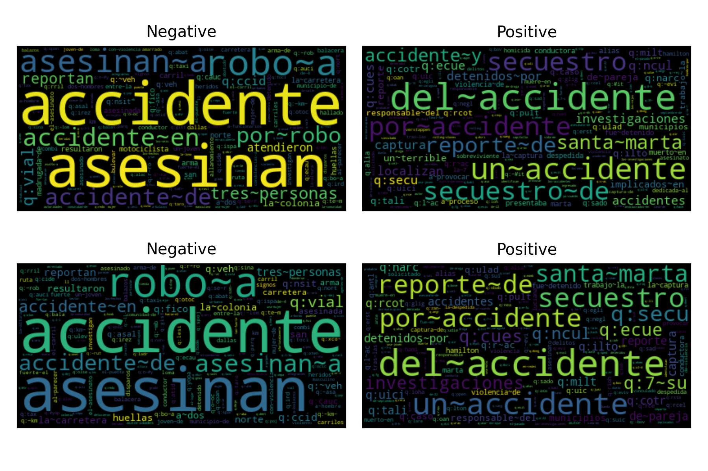
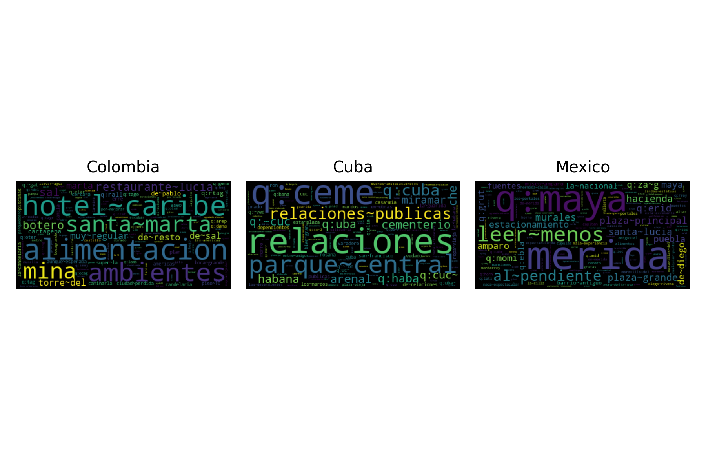

.. _competition:
.. py:currentmodule:: EvoMSA.competitions

====================================
Text Classifier Competitions
====================================
.. image:: https://github.com/INGEOTEC/EvoMSA/actions/workflows/test.yaml/badge.svg
		:target: https://github.com/INGEOTEC/EvoMSA/actions/workflows/test.yaml

.. image:: https://coveralls.io/repos/github/INGEOTEC/EvoMSA/badge.svg?branch=develop
		:target: https://coveralls.io/github/INGEOTEC/EvoMSA?branch=develop

.. image:: https://badge.fury.io/py/EvoMSA.svg
		:target: https://badge.fury.io/py/EvoMSA

.. image:: https://dev.azure.com/conda-forge/feedstock-builds/_apis/build/status/evomsa-feedstock?branchName=main
	    :target: https://dev.azure.com/conda-forge/feedstock-builds/_build/latest?definitionId=16466&branchName=main

.. image:: https://img.shields.io/conda/vn/conda-forge/evomsa.svg
		:target: https://anaconda.org/conda-forge/evomsa

.. image:: https://img.shields.io/conda/pn/conda-forge/evomsa.svg
		:target: https://anaconda.org/conda-forge/evomsa

.. image:: https://readthedocs.org/projects/evomsa/badge/?version=docs
		:target: https://evomsa.readthedocs.io/en/docs/?badge=docs

Text classification (TC) is a Natural Language Processing (NLP) task focused on identifying a text's label. A standard approach to tackle text classification problems is to pose it as a supervised learning problem. In supervised learning, everything starts with a dataset composed of pairs of inputs and outputs; in this case, the inputs are texts, and the outputs correspond to the associated labels. The aim is that the developed algorithm can automatically assign a label to any given text independently, whether it was in the original dataset. The feasible classes are only those found on the original dataset. In some circumstances, the method can also inform the confidence it has in its prediction so the user can decide whether to use or discard it.

Following a supervised learning approach requires that the input is in amenable representation for the learning algorithm; usually, this could be a vector. One of the most common methods to represent a text into a vector is to use a Bag of Word (:ref:`bow`) model, which works by having a fixed vocabulary where each component represents an element in the vocabulary and the presence of it in the text is given by a non-zero value.

The text classifier's performance depends on the representation quality and the classifier used. Deciding which representation and algorithm to use is daunting; in this contribution, we describe a set of classifiers that can be used, out of the box, for a new text classification problem. These classifiers are based on the :ref:`BoW` model. Nonetheless, some methods, namely :ref:`DenseBoW`, represent the text following two stages. The first one uses a set of BoW models and classifiers trained on self-supervised problems, where each task predicts the presence of a particular token. Consequently, the text is presented in a vector where each component is associated with a token, and the existence of it is encoded in the value. The methods used BoW models, and DenseBoW were combined using a stack generalization approach, namely :ref:`StackGeneralization`. 

The text classifiers presented have been tested in many text classifier competitions without modifications. The aim is to offer a better understanding of how these algorithms perform in a new situation and what would be the difference in performance with an algorithm tailored to the new problem. We test 13 different algorithms for each task of each competition. The configuration having the best performance was submitted to the contest. The best performance was computed using either a k-fold cross-validation or a validation set, depending on the information provided by the challenge.

Results
------------------------------

Following an unconventional approach, the performance of :ref:`v2` in different competitions is presented before describing the parameters used and the challenges. The following table presents the performance; it includes the performance of the system that wins the competition, the performance of :ref:`v2`, and the difference between them in percentage. 

.. list-table:: Competitions 
    :header-rows: 1

    * - Competitions
      - Edition
      - Winner 
      - :ref:`v2` 
      - Difference
    * - :ref:`HaSpeeDe3 (textual) <haspeede>`
      - 2023 
      - 0.9128
      - 0.8845 (:py:func:`Conf. <EvoMSA.competitions.Comp2023.stack_2_bow_tailored_keywords>`)
      - 3.2%
    * - :ref:`HaSpeeDe3 (XReligiousHate) <haspeede>`
      - 2023 
      - 0.6525
      - 0.5522 (:py:func:`Conf. <EvoMSA.competitions.Comp2023.stack_2_bow_tailored_keywords>`)
      - 18.2% 
    * - :ref:`HODI <hodi>` 
      - 2023
      - 0.81079 
      - 0.71527 (:py:func:`Conf. <EvoMSA.competitions.Comp2023.stack_3_bows_tailored_keywords>`)
      - 13.4%
    * - :ref:`ACTI <acti>`
      - 2023
      - 0.85712
      - 0.78207 (:py:func:`Conf. <EvoMSA.competitions.Comp2023.stack_3_bows_tailored_keywords>`)
      - 9.6%
    * - :ref:`PoliticIT (Global) <politicit>`
      - 2023
      - 0.824057
      - 0.762001
      - 8.1%
    * - :ref:`PoliticIT (Gender) <politicit>`
      - 2023
      - 0.824287
      - 0.732259 (:py:func:`Conf. <EvoMSA.competitions.Comp2023.stack_3_bows>`)
      - 12.6%
    * - :ref:`PoliticIT (Ideology Binary) <politicit>`
      - 2023
      - 0.928223
      - 0.848525 (:py:func:`Conf. <EvoMSA.competitions.Comp2023.bow_training_set>`)
      - 9.4%
    * - :ref:`PoliticIT (Ideology Multiclass) <politicit>`
      - 2023
      - 0.751477
      - 0.705220 (:py:func:`Conf. <EvoMSA.competitions.Comp2023.stack_3_bows>`)
      - 6.6%
    * - :ref:`PoliticEs (Global) <politicses>`
      - 2023
      - 0.811319
      - 0.777584
      - 4.3%
    * - :ref:`PoliticEs (Gender) <politicses>`
      - 2023
      - 0.829633
      - 0.711549 (:py:func:`Conf. <EvoMSA.competitions.Comp2023.stack_3_bows>`)
      - 16.6%
    * - :ref:`PoliticEs (Profession) <politicses>`
      - 2023
      - 0.860824
      - 0.837945 (:py:func:`Conf. <EvoMSA.competitions.Comp2023.stack_3_bows>`)
      - 2.7%
    * - :ref:`PoliticEs (Ideology Binary) <politicses>`
      - 2023
      - 0.896715
      - 0.891394 (:py:func:`Conf. <EvoMSA.competitions.Comp2023.stack_3_bows>`)
      - 0.6%
    * - :ref:`PoliticEs (Ideology Multiclass) <politicses>`
      - 2023
      - 0.691334
      - 0.669448 (:py:func:`Conf. <EvoMSA.competitions.Comp2023.stack_3_bows>`)
      - 3.3%
    * - :ref:`DA-VINCIS <davincis>`
      - 2023
      - 0.9264
      - 0.8903 (:py:func:`Conf. <EvoMSA.competitions.Comp2023.stack_2_bow_tailored_all_keywords>`)
      - 4.1%
    * - :ref:`DA-VINCIS <davincis-2022>`
      - 2022
      - 0.7817
      - 0.7510 (:py:func:`Conf. <EvoMSA.competitions.Comp2023.stack_2_bow_all_keywords>`)
      - 4.1%
    * - :ref:`Rest-Mex (Global) <rest-mex-liga>`
      - 2023
      - 0.7790190145
      - 0.7375714730
      - 5.6%
    * - :ref:`Rest-Mex (Polarity) <rest-mex-liga>`
      - 2023
      - 0.621691991
      - 0.554880778 (:py:func:`Conf. <EvoMSA.competitions.Comp2023.stack_bows>`)
      - 12.0%
    * - :ref:`Rest-Mex (Type) <rest-mex-liga>`
      - 2023
      - 0.99032231
      - 0.980539122 (:py:func:`Conf. <EvoMSA.competitions.Comp2023.bow_training_set>`)
      - 1.0%
    * - :ref:`Rest-Mex (Country) <rest-mex-liga>`
      - 2023
      - 0.942028113
      - 0.927052594 (:py:func:`Conf. <EvoMSA.competitions.Comp2023.bow_training_set>`)
      - 1.6%    
    * - :ref:`HOMO-MEX <homo-mex>`
      - 2023
      - 0.8847
      - 0.8050 (:py:func:`Conf. <EvoMSA.competitions.Comp2023.stack_3_bow_tailored_all_keywords>`)
      - 9.9%
    * - :ref:`HOPE (ES) <hope>`
      - 2023
      - 0.9161
      - 0.4198 (:py:func:`Conf. <EvoMSA.competitions.Comp2023.stack_bow_keywords_emojis_voc_selection>`)
      - 118.2%
    * - :ref:`HOPE (EN) <hope>`
      - 2023
      - 0.5012
      - 0.4429 (:py:func:`Conf. <EvoMSA.competitions.Comp2023.stack_bow_keywords_emojis>`)
      - 13.2%
    * - :ref:`DIPROMATS (ES) <dipromats>`
      - 2023
      - 0.8089
      - 0.7485 (:py:func:`Conf. <EvoMSA.competitions.Comp2023.stack_3_bows>`)
      - 8.1%
    * - :ref:`DIPROMATS (EN) <dipromats>`
      - 2023
      - 0.8090
      - 0.7255 (:py:func:`Conf. <EvoMSA.competitions.Comp2023.stack_3_bow_tailored_all_keywords>`)
      - 11.5%
    * - :ref:`HUHU <huhu>`
      - 2023
      - 0.820
      - 0.775 (:py:func:`Conf. <EvoMSA.competitions.Comp2023.stack_2_bow_all_keywords>`)
      - 5.8%
    * - :ref:`TASS <tass>`
      - 2017
      - 0.577  
      - 0.525 (:py:func:`Conf. <EvoMSA.competitions.Comp2023.stack_2_bow_tailored_all_keywords>`)
      - 9.9%
    * - :ref:`EDOS (A) <edos>`
      - 2023
      - 0.8746
      - 0.7890 (:py:func:`Conf. <EvoMSA.competitions.Comp2023.stack_2_bow_keywords>`)
      - 10.8%
    * - :ref:`EDOS (B) <edos>`
      - 2023
      - 0.7326
      - 0.5413 (:py:func:`Conf. <EvoMSA.competitions.Comp2023.stack_bow_keywords_emojis>`)
      - 35.3%
    * - :ref:`EDOS (C) <edos>`
      - 2023
      - 0.5606
      - 0.3500 (:py:func:`Conf. <EvoMSA.competitions.Comp2023.stack_2_bow_all_keywords>`)
      - 60.2%

Competitions
------------------------------
.. _haspeede:

`Hate Speech Detection (HaSpeeDe3) <http://www.di.unito.it/~tutreeb/haspeede-evalita23/index.html>`_
^^^^^^^^^^^^^^^^^^^^^^^^^^^^^^^^^^^^^^^^^^^^^^^^^^^^^^^^^^^^^^^^^^^^^^^^^^^^^^^^^^^^^^^^^^^^^^^^^^^^^

.. list-table:: Performance in Cross-validation
    :header-rows: 1

    * - Configuration
      - Performance
      - p-value
    * - :py:func:`Comp2023.stack_2_bow_tailored_keywords`
      - 0.8778
      - 1.0000
    * - :py:func:`Comp2023.stack_3_bows_tailored_keywords`
      - 0.8769
      - 0.2720
    * - :py:func:`Comp2023.stack_2_bow_keywords`
      - 0.8756
      - 0.0500
    * - :py:func:`Comp2023.stack_bow_keywords_emojis_voc_selection`
      - 0.8754
      - 0.1380
    * - :py:func:`Comp2023.bow_voc_selection`
      - 0.8751
      - 0.1600
    * - :py:func:`Comp2023.stack_bows`
      - 0.8745
      - 0.1020
    * - :py:func:`Comp2023.bow`
      - 0.8740
      - 0.0780
    * - :py:func:`Comp2023.stack_bow_keywords_emojis`
      - 0.8727
      - 0.0080
    * - :py:func:`Comp2023.stack_3_bows`
      - 0.8723
      - 0.0260
    * - :py:func:`Comp2023.bow_training_set`
      - 0.8688
      - 0.0000
.. _hodi:

`Homotransphobia Detection in Italian (HODI) <https://hodi-evalita.github.io>`_
^^^^^^^^^^^^^^^^^^^^^^^^^^^^^^^^^^^^^^^^^^^^^^^^^^^^^^^^^^^^^^^^^^^^^^^^^^^^^^^^^

.. list-table:: Performance in Cross-validation
    :header-rows: 1

    * - Configuration
      - Performance
      - p-value
    * - :py:func:`Comp2023.stack_3_bows_tailored_keywords`
      - 0.7883
      - 1.0000
    * - :py:func:`Comp2023.stack_bows`
      - 0.7875
      - 0.3900
    * - :py:func:`Comp2023.stack_3_bows`
      - 0.7864
      - 0.2360
    * - :py:func:`Comp2023.bow_voc_selection`
      - 0.7862
      - 0.2640
    * - :py:func:`Comp2023.bow`
      - 0.7842
      - 0.1100
    * - :py:func:`Comp2023.stack_2_bow_tailored_keywords`
      - 0.7838
      - 0.0060
    * - :py:func:`Comp2023.bow_training_set`
      - 0.7833
      - 0.0620
    * - :py:func:`Comp2023.stack_2_bow_keywords`
      - 0.7830
      - 0.0000
    * - :py:func:`Comp2023.stack_bow_keywords_emojis_voc_selection`
      - 0.7765
      - 0.0000
    * - :py:func:`Comp2023.stack_bow_keywords_emojis`
      - 0.7758
      - 0.0000

.. _acti:

`Automatic Conspiracy Theory Identification (ACTI) <https://russogiuseppe.github.io/ACTI>`_
^^^^^^^^^^^^^^^^^^^^^^^^^^^^^^^^^^^^^^^^^^^^^^^^^^^^^^^^^^^^^^^^^^^^^^^^^^^^^^^^^^^^^^^^^^^^^^

.. list-table:: Performance in Cross-validation
    :header-rows: 1

    * - Configuration
      - Performance
      - p-value
    * - :py:func:`Comp2023.stack_3_bows_tailored_keywords`
      - 0.7914
      - 1.0000
    * - :py:func:`Comp2023.stack_2_bow_tailored_keywords`
      - 0.7872
      - 0.1180
    * - :py:func:`Comp2023.stack_3_bows`
      - 0.7855
      - 0.1700
    * - :py:func:`Comp2023.stack_2_bow_keywords`
      - 0.7855
      - 0.0740
    * - :py:func:`Comp2023.stack_bow_keywords_emojis_voc_selection`
      - 0.7804
      - 0.0240
    * - :py:func:`Comp2023.stack_bows`
      - 0.7785
      - 0.0260
    * - :py:func:`Comp2023.bow_voc_selection`
      - 0.7780
      - 0.0200
    * - :py:func:`Comp2023.bow_training_set`
      - 0.7765
      - 0.0040
    * - :py:func:`Comp2023.bow`
      - 0.7758
      - 0.0040
    * - :py:func:`Comp2023.stack_bow_keywords_emojis`
      - 0.7755
      - 0.0000

.. _politicit:

`Political Ideology Detection in Italian Texts (PoliticIT) <https://codalab.lisn.upsaclay.fr/competitions/8507>`_ 
^^^^^^^^^^^^^^^^^^^^^^^^^^^^^^^^^^^^^^^^^^^^^^^^^^^^^^^^^^^^^^^^^^^^^^^^^^^^^^^^^^^^^^^^^^^^^^^^^^^^^^^^^^^^^^^^^^^^

.. list-table:: Performance in Cross-validation (Gender)
    :header-rows: 1

    * - Configuration
      - Performance
      - p-value
    * - :py:func:`Comp2023.stack_3_bows`
      - 0.9792
      - 1.0000
    * - :py:func:`Comp2023.stack_bows`
      - 0.9583
      - 0.2120
    * - :py:func:`Comp2023.stack_3_bows_tailored_keywords`
      - 0.9583
      - 0.2340
    * - :py:func:`Comp2023.bow_training_set`
      - 0.9375
      - 0.1260
    * - :py:func:`Comp2023.stack_2_bow_keywords`
      - 0.8748
      - 0.0200
    * - :py:func:`Comp2023.stack_2_bow_tailored_keywords`
      - 0.8748
      - 0.0200
    * - :py:func:`Comp2023.stack_bow_keywords_emojis`
      - 0.8536
      - 0.0160
    * - :py:func:`Comp2023.stack_bow_keywords_emojis_voc_selection`
      - 0.8536
      - 0.0160
    * - :py:func:`Comp2023.bow`
      - 0.8307
      - 0.0000
    * - :py:func:`Comp2023.bow_voc_selection`
      - 0.8307
      - 0.0000

.. list-table:: Performance in Cross-validation (Ideology Binary)
    :header-rows: 1

    * - Configuration
      - Performance
      - p-value
    * - :py:func:`Comp2023.bow_training_set`
      - 1.0000
      - 1.0000
    * - :py:func:`Comp2023.stack_3_bows`
      - 0.9714
      - 0.1580
    * - :py:func:`Comp2023.stack_3_bows_tailored_keywords`
      - 0.9714
      - 0.1580
    * - :py:func:`Comp2023.stack_bows`
      - 0.8712
      - 0.0200
    * - :py:func:`Comp2023.bow`
      - 0.8487
      - 0.0120
    * - :py:func:`Comp2023.bow_voc_selection`
      - 0.8487
      - 0.0120
    * - :py:func:`Comp2023.stack_2_bow_keywords`
      - 0.8271
      - 0.0060
    * - :py:func:`Comp2023.stack_2_bow_tailored_keywords`
      - 0.8271
      - 0.0060
    * - :py:func:`Comp2023.stack_bow_keywords_emojis`
      - 0.7856
      - 0.0040
    * - :py:func:`Comp2023.stack_bow_keywords_emojis_voc_selection`
      - 0.7856
      - 0.0040

.. list-table:: Performance in Cross-validation (Ideology Multiclass)
    :header-rows: 1

    * - Configuration
      - Performance
      - p-value
    * - :py:func:`Comp2023.stack_3_bows`
      - 0.9834
      - 1.0000
    * - :py:func:`Comp2023.stack_3_bows_tailored_keywords`
      - 0.9834
      - 1.0000
    * - :py:func:`Comp2023.bow_training_set`
      - 0.9823
      - 0.4100
    * - :py:func:`Comp2023.stack_bows`
      - 0.7756
      - 0.0020
    * - :py:func:`Comp2023.stack_bow_keywords_emojis`
      - 0.7271
      - 0.0000
    * - :py:func:`Comp2023.stack_2_bow_tailored_keywords`
      - 0.7271
      - 0.0000
    * - :py:func:`Comp2023.stack_bow_keywords_emojis_voc_selection`
      - 0.7111
      - 0.0000
    * - :py:func:`Comp2023.stack_2_bow_keywords`
      - 0.7111
      - 0.0000
    * - :py:func:`Comp2023.bow`
      - 0.5308
      - 0.0000
    * - :py:func:`Comp2023.bow_voc_selection`
      - 0.5308
      - 0.0000

.. _politicses:

`Political Ideology Detection in Spanish Texts (PoliticEs) <https://codalab.lisn.upsaclay.fr/competitions/10173>`_
^^^^^^^^^^^^^^^^^^^^^^^^^^^^^^^^^^^^^^^^^^^^^^^^^^^^^^^^^^^^^^^^^^^^^^^^^^^^^^^^^^^^^^^^^^^^^^^^^^^^^^^^^^^^^^^^^^^^

.. list-table:: Performance in Cross-validation (Gender)
    :header-rows: 1

    * - Configuration
      - Performance
      - p-value
    * - :py:func:`Comp2023.bow_training_set`
      - 1.0000
      - 1.0000
    * - :py:func:`Comp2023.stack_3_bows`
      - 0.9764
      - 0.1080
    * - :py:func:`Comp2023.stack_3_bows_tailored_keywords`
      - 0.9643
      - 0.0660
    * - :py:func:`Comp2023.stack_3_bow_tailored_all_keywords`
      - 0.9643
      - 0.0660
    * - :py:func:`Comp2023.stack_bows`
      - 0.9406
      - 0.0200
    * - :py:func:`Comp2023.stack_2_bow_keywords`
      - 0.9406
      - 0.0200
    * - :py:func:`Comp2023.stack_2_bow_tailored_keywords`
      - 0.9406
      - 0.0200
    * - :py:func:`Comp2023.stack_2_bow_all_keywords`
      - 0.9406
      - 0.0200
    * - :py:func:`Comp2023.stack_2_bow_tailored_all_keywords`
      - 0.9406
      - 0.0200
    * - :py:func:`Comp2023.bow`
      - 0.9398
      - 0.0320
    * - :py:func:`Comp2023.bow_voc_selection`
      - 0.9398
      - 0.0320
    * - :py:func:`Comp2023.stack_bow_keywords_emojis`
      - 0.9291
      - 0.0180
    * - :py:func:`Comp2023.stack_bow_keywords_emojis_voc_selection`
      - 0.9291
      - 0.0180

.. list-table:: Performance in Cross-validation (Profession)
    :header-rows: 1

    * - Configuration
      - Performance
      - p-value
    * - :py:func:`Comp2023.stack_3_bows`
      - 1.0000
      - 1.0000
    * - :py:func:`Comp2023.bow_training_set`
      - 1.0000
      - 1.0000
    * - :py:func:`Comp2023.stack_3_bows_tailored_keywords`
      - 1.0000
      - 1.0000
    * - :py:func:`Comp2023.stack_3_bow_tailored_all_keywords`
      - 1.0000
      - 1.0000
    * - :py:func:`Comp2023.bow`
      - 0.9756
      - 0.0680
    * - :py:func:`Comp2023.bow_voc_selection`
      - 0.9756
      - 0.0680
    * - :py:func:`Comp2023.stack_bows`
      - 0.9597
      - 0.1920
    * - :py:func:`Comp2023.stack_bow_keywords_emojis`
      - 0.9352
      - 0.1000
    * - :py:func:`Comp2023.stack_bow_keywords_emojis_voc_selection`
      - 0.9352
      - 0.1000
    * - :py:func:`Comp2023.stack_2_bow_keywords`
      - 0.9105
      - 0.0920
    * - :py:func:`Comp2023.stack_2_bow_all_keywords`
      - 0.9105
      - 0.0920
    * - :py:func:`Comp2023.stack_2_bow_tailored_keywords`
      - 0.9022
      - 0.0880
    * - :py:func:`Comp2023.stack_2_bow_tailored_all_keywords`
      - 0.9022
      - 0.0880

.. list-table:: Performance in Cross-validation (Ideology Binary)
    :header-rows: 1

    * - Configuration
      - Performance
      - p-value
    * - :py:func:`Comp2023.stack_3_bows`
      - 1.0000
      - 1.0000
    * - :py:func:`Comp2023.bow_training_set`
      - 1.0000
      - 1.0000
    * - :py:func:`Comp2023.stack_3_bows_tailored_keywords`
      - 1.0000
      - 1.0000
    * - :py:func:`Comp2023.stack_3_bow_tailored_all_keywords`
      - 1.0000
      - 1.0000
    * - :py:func:`Comp2023.stack_bow_keywords_emojis_voc_selection`
      - 0.9657
      - 0.0740
    * - :py:func:`Comp2023.stack_2_bow_keywords`
      - 0.9657
      - 0.0760
    * - :py:func:`Comp2023.stack_2_bow_tailored_keywords`
      - 0.9657
      - 0.0760
    * - :py:func:`Comp2023.stack_2_bow_all_keywords`
      - 0.9657
      - 0.0760
    * - :py:func:`Comp2023.stack_2_bow_tailored_all_keywords`
      - 0.9657
      - 0.0760
    * - :py:func:`Comp2023.bow`
      - 0.9545
      - 0.0420
    * - :py:func:`Comp2023.bow_voc_selection`
      - 0.9545
      - 0.0420
    * - :py:func:`Comp2023.stack_bows`
      - 0.9545
      - 0.0420
    * - :py:func:`Comp2023.stack_bow_keywords_emojis`
      - 0.9541
      - 0.0620

.. list-table:: Performance in Cross-validation (Ideology Multiclass)
    :header-rows: 1

    * - Configuration
      - Performance
      - p-value
    * - :py:func:`Comp2023.stack_3_bows`
      - 1.0000
      - 1.0000
    * - :py:func:`Comp2023.bow_training_set`
      - 1.0000
      - 1.0000
    * - :py:func:`Comp2023.stack_3_bows_tailored_keywords`
      - 0.9889
      - 0.1780
    * - :py:func:`Comp2023.stack_3_bow_tailored_all_keywords`
      - 0.9889
      - 0.1780
    * - :py:func:`Comp2023.bow`
      - 0.9644
      - 0.0400
    * - :py:func:`Comp2023.bow_voc_selection`
      - 0.9644
      - 0.0400
    * - :py:func:`Comp2023.stack_bows`
      - 0.9369
      - 0.0160
    * - :py:func:`Comp2023.stack_2_bow_keywords`
      - 0.9225
      - 0.0000
    * - :py:func:`Comp2023.stack_2_bow_all_keywords`
      - 0.9225
      - 0.0000
    * - :py:func:`Comp2023.stack_2_bow_tailored_keywords`
      - 0.9121
      - 0.0040
    * - :py:func:`Comp2023.stack_2_bow_tailored_all_keywords`
      - 0.9121
      - 0.0040
    * - :py:func:`Comp2023.stack_bow_keywords_emojis_voc_selection`
      - 0.8475
      - 0.0000
    * - :py:func:`Comp2023.stack_bow_keywords_emojis`
      - 0.8467
      - 0.0000

.. _davincis:

`Detection of Aggressive and Violent Incidents from Social Media in Spanish (DA-VINCIS) <https://sites.google.com/view/davincis-iberlef-2023>`_
^^^^^^^^^^^^^^^^^^^^^^^^^^^^^^^^^^^^^^^^^^^^^^^^^^^^^^^^^^^^^^^^^^^^^^^^^^^^^^^^^^^^^^^^^^^^^^^^^^^^^^^^^^^^^^^^^^^^^^^^^^^^^^^^^^^^^^^^^^^^^^^^

The `DA-VINCIS <http://journal.sepln.org/sepln/ojs/ojs/index.php/pln/article/view/6565>`_ task presented at IberLEF 2023 focused on detecting violent events in social networks. The track has two tasks: the first was to detect texts indicating violent incidents, and the second was a multiclass problem where the categories correspond to different violent incidents. 

The following table presents the performance, in terms of :math:`f_1` score, for the different systems tested for the polarity task. The performance was estimated using stratified k-fold (:math:`k=5`) cross-validation. 

It can be observed that the best configuration corresponds to a Stack Generalization using two :py:class:`~EvoMSA.text_repr.BoW` systems and two :py:class:`~EvoMSA.text_repr.DenseBoW` as its base classifier. It is statistically equivalent to different configurations; however, the system submitted was the one with the best performance in the table. 

The following code can generate an instance of the system used in the competition. It must be noted that one needs to supply the training set because the method :py:attr:`~EvoMSA.competitions.Comp2023.stack_2_bow_tailored_all_keywords` performs a feature selection algorithm. 

.. code-block:: python

  >>> from EvoMSA.competitions import Comp2023
  >>> import numpy as np
  >>> X = ['text 1', 'text 2']
  >>> y = np.r_[[0, 1]]
  >>> tailored = 'IberLEF2023_DAVINCIS_task1_Es.json.gz'
  >>> comp2023 = Comp2023(lang='es', 
  >>>              tailored=tailored)
  >>> ins = comp2023.stack_2_bow_tailored_all_keywords(X, y)

.. list-table:: Performance in Cross-validation
    :header-rows: 1

    * - Configuration
      - Performance
      - p-value
    * - :py:func:`Comp2023.stack_2_bow_tailored_all_keywords`
      - 0.8984
      - 1.0000
    * - :py:func:`Comp2023.stack_3_bows_tailored_keywords`
      - 0.8971
      - 0.2260
    * - :py:func:`Comp2023.stack_3_bow_tailored_all_keywords`
      - 0.8968
      - 0.2120
    * - :py:func:`Comp2023.stack_2_bow_tailored_keywords`
      - 0.8966
      - 0.1580
    * - :py:func:`Comp2023.stack_2_bow_keywords`
      - 0.8955
      - 0.0540
    * - :py:func:`Comp2023.stack_2_bow_all_keywords`
      - 0.8951
      - 0.0440
    * - :py:func:`Comp2023.stack_3_bows`
      - 0.8931
      - 0.0760
    * - :py:func:`Comp2023.bow_voc_selection`
      - 0.8907
      - 0.0260
    * - :py:func:`Comp2023.bow`
      - 0.8894
      - 0.0180
    * - :py:func:`Comp2023.bow_training_set`
      - 0.8892
      - 0.0060
    * - :py:func:`Comp2023.stack_bows`
      - 0.8879
      - 0.0020
    * - :py:func:`Comp2023.stack_bow_keywords_emojis`
      - 0.8863
      - 0.0000
    * - :py:func:`Comp2023.stack_bow_keywords_emojis_voc_selection`
      - 0.8859
      - 0.0000

The system is composed of four base text classifiers. A procedure to visualize the behavior of the classifier is to generate a word cloud where the size of the tokens indicates its discriminant capacity. 

The following figure presents the word clouds generated for the two :py:class:`~EvoMSA.text_repr.BoW` systems. The difference between these systems is the vocabulary; the first uses the default vocabulary, and the second uses `voc_selection='most_common'`. The first row presents the word cloud corresponding to the first :py:class:`~EvoMSA.text_repr.BoW` text classifier, and the second row corresponds to the second text classifier. It is not evident to find the difference between the two models; this indicates that the difference must be in the tail of the distribution. 

The following table presents the performance of these systems; it can be observed that the systems have a similar performance.

.. list-table:: Performance of :py:class:`~EvoMSA.text_repr.BoW` systems
    :header-rows: 1

    * - Configuration
      - Recall
      - Precision
      - :math:`f_1`
    * - Default
      - 0.8677
      - 0.9023
      - 0.8846
    * - `voc_selection='most_common'`
      - 0.8692
      - 0.901
      - 0.8848

The following figure complements the description by presenting the word cloud of the :py:class:`~EvoMSA.text_repr.DenseBoW` systems. The difference between these systems is that the first one uses the default vocabulary, and as dense models, it includes representations where the predicted keyword was taken from the training set of the competition, i.e., these are tailored keywords. The second :py:class:`~EvoMSA.text_repr.DenseBoW` uses as vocabulary `voc_selection='most_common'`, and the default dense models. 

The first row of the figure presents the word cloud corresponding to the tailored keywords, and the second row presents the clouds for the second model. It can be observed from the figure that the more discriminant features are different in the word cloud shown in the first row against the counterpart of the second row. 

.. image:: comp2023/davincis-denses.png

The following table presents the performance of these systems; it can be observed that the systems have a similar performance to the :py:class:`~EvoMSA.text_repr.BoW` systems. The only system with a lower performance is the :py:class:`~EvoMSA.text_repr.DenseBoW` with `voc_selection='most_common'`, which can be observed in the :math:`f_1` score.

.. list-table:: Performance of :py:class:`~EvoMSA.text_repr.DenseBoW` systems
    :header-rows: 1

    * - Configuration
      - Recall
      - Precision
      - :math:`f_1`
    * - Tailored Keywords
      - 0.8724
      - 0.902
      - 0.8869
    * - `voc_selection='most_common'`
      - 0.8708
      - 0.8882
      - 0.8794

.. _davincis-2022:

`Detection of Aggressive and Violent Incidents from Social Media in Spanish (DA-VINCIS 2022) <https://sites.google.com/view/davincis-iberlef/home>`_
^^^^^^^^^^^^^^^^^^^^^^^^^^^^^^^^^^^^^^^^^^^^^^^^^^^^^^^^^^^^^^^^^^^^^^^^^^^^^^^^^^^^^^^^^^^^^^^^^^^^^^^^^^^^^^^^^^^^^^^^^^^^^^^^^^^^^^^^^^^^^^^^^^^^^

.. list-table:: Performance in Cross-validation
    :header-rows: 1

    * - Configuration
      - Performance
      - p-value
    * - :py:func:`Comp2023.stack_2_bow_all_keywords`
      - 0.8447
      - 1.0000
    * - :py:func:`Comp2023.stack_2_bow_tailored_all_keywords`
      - 0.8361
      - 0.0000
    * - :py:func:`Comp2023.stack_3_bow_tailored_all_keywords`
      - 0.8219
      - 0.0000
    * - :py:func:`Comp2023.stack_bow_keywords_emojis`
      - 0.7595
      - 0.0000
    * - :py:func:`Comp2023.stack_bow_keywords_emojis_voc_selection`
      - 0.7588
      - 0.0000
    * - :py:func:`Comp2023.stack_2_bow_tailored_keywords`
      - 0.7572
      - 0.0000
    * - :py:func:`Comp2023.stack_3_bows_tailored_keywords`
      - 0.7555
      - 0.0000
    * - :py:func:`Comp2023.stack_2_bow_keywords`
      - 0.7525
      - 0.0000
    * - :py:func:`Comp2023.bow_voc_selection`
      - 0.7342
      - 0.0000
    * - :py:func:`Comp2023.bow_training_set`
      - 0.7337
      - 0.0000
    * - :py:func:`Comp2023.stack_bows`
      - 0.7329
      - 0.0000
    * - :py:func:`Comp2023.stack_3_bows`
      - 0.7329
      - 0.0000
    * - :py:func:`Comp2023.bow`
      - 0.7324
      - 0.0000

.. _rest-mex-liga:

`Research on Sentiment Analysis Task for Mexican Tourist Texts (Rest-Mex) <https://sites.google.com/cimat.mx/rest-mex2023>`_
^^^^^^^^^^^^^^^^^^^^^^^^^^^^^^^^^^^^^^^^^^^^^^^^^^^^^^^^^^^^^^^^^^^^^^^^^^^^^^^^^^^^^^^^^^^^^^^^^^^^^^^^^^^^^^^^^^^^^^^^^^^^^^

The `Rest-Mex <http://journal.sepln.org/sepln/ojs/ojs/index.php/pln/article/view/6572>`_ task presented at IberLEF 2023 focused sentiment analysis and clustering on tourist texts; nonetheless, our participation was only on the sentiment analysis tasks. The first task consisted of identifying the polarity of the tourist text. The second task was to identify whether the visited place was either an attraction, hotel, or restaurant. The third and last task was identifying the country (i.e., Colombia, Cuba, and Mexico).

The following table presents the performance, in terms of macro-f1, for the different systems tested for the polarity task. It can be observed that the best configuration corresponds to a Stack Generalization using two :py:class:`~EvoMSA.text_repr.BoW` systems as its base classifier. It is statistically equivalent to Stacking Generalization using three :py:class:`~EvoMSA.text_repr.BoW`.

.. list-table:: Performance in Cross-validation (Polarity)
    :header-rows: 1

    * - Configuration
      - Performance
      - p-value
    * - :py:func:`Comp2023.stack_bows`
      - 0.5605
      - 1.0000
    * - :py:func:`Comp2023.stack_3_bows`
      - 0.5603
      - 0.4140
    * - :py:func:`Comp2023.stack_3_bows_tailored_keywords`
      - 0.5472
      - 0.0000
    * - :py:func:`Comp2023.stack_3_bow_tailored_all_keywords`
      - 0.5467
      - 0.0000
    * - :py:func:`Comp2023.stack_2_bow_tailored_keywords`
      - 0.5448
      - 0.0000
    * - :py:func:`Comp2023.stack_2_bow_tailored_all_keywords`
      - 0.5446
      - 0.0000
    * - :py:func:`Comp2023.stack_2_bow_all_keywords`
      - 0.5431
      - 0.0000
    * - :py:func:`Comp2023.stack_2_bow_keywords`
      - 0.5420
      - 0.0000
    * - :py:func:`Comp2023.stack_bow_keywords_emojis_voc_selection`
      - 0.5346
      - 0.0000
    * - :py:func:`Comp2023.stack_bow_keywords_emojis`
      - 0.5310
      - 0.0000
    * - :py:func:`Comp2023.bow_training_set`
      - 0.5179
      - 0.0000
    * - :py:func:`Comp2023.bow`
      - 0.5167
      - 0.0000
    * - :py:func:`Comp2023.bow_voc_selection`
      - 0.5152
      - 0.0000

The following figure presents a word cloud with the most discriminative tokens for each class in the polarity task. 

.. image:: comp2023/restmex-polarity.png

.. list-table:: Performance in Cross-validation (Type)
    :header-rows: 1

    * - Configuration
      - Performance
      - p-value
    * - :py:func:`Comp2023.bow_training_set`
      - 0.9802
      - 1.0000
    * - :py:func:`Comp2023.bow`
      - 0.9793
      - 0.0040
    * - :py:func:`Comp2023.stack_3_bows`
      - 0.9793
      - 0.0000
    * - :py:func:`Comp2023.bow_voc_selection`
      - 0.9792
      - 0.0000
    * - :py:func:`Comp2023.stack_3_bow_tailored_all_keywords`
      - 0.9783
      - 0.0000
    * - :py:func:`Comp2023.stack_3_bows_tailored_keywords`
      - 0.9783
      - 0.0000
    * - :py:func:`Comp2023.stack_bows`
      - 0.9782
      - 0.0000
    * - :py:func:`Comp2023.stack_2_bow_tailored_keywords`
      - 0.9773
      - 0.0000
    * - :py:func:`Comp2023.stack_2_bow_tailored_all_keywords`
      - 0.9773
      - 0.0000
    * - :py:func:`Comp2023.stack_2_bow_keywords`
      - 0.9769
      - 0.0000
    * - :py:func:`Comp2023.stack_2_bow_all_keywords`
      - 0.9768
      - 0.0000
    * - :py:func:`Comp2023.stack_bow_keywords_emojis`
      - 0.9743
      - 0.0000
    * - :py:func:`Comp2023.stack_bow_keywords_emojis_voc_selection`
      - 0.9742
      - 0.0000

The following figure presents a word cloud with the most discriminative tokens for each class in the type task. 

.. image:: comp2023/restmex-type.png

.. list-table:: Performance in Cross-validation (Country)
    :header-rows: 1

    * - Configuration
      - Performance
      - p-value
    * - :py:func:`Comp2023.bow_training_set`
      - 0.9260
      - 1.0000
    * - :py:func:`Comp2023.stack_3_bows`
      - 0.9225
      - 0.0000
    * - :py:func:`Comp2023.bow_voc_selection`
      - 0.9200
      - 0.0000
    * - :py:func:`Comp2023.bow`
      - 0.9194
      - 0.0000
    * - :py:func:`Comp2023.stack_bows`
      - 0.9167
      - 0.0000
    * - :py:func:`Comp2023.stack_3_bow_tailored_all_keywords`
      - 0.9166
      - 0.0000
    * - :py:func:`Comp2023.stack_3_bows_tailored_keywords`
      - 0.9164
      - 0.0000
    * - :py:func:`Comp2023.stack_2_bow_tailored_all_keywords`
      - 0.9101
      - 0.0000
    * - :py:func:`Comp2023.stack_2_bow_tailored_keywords`
      - 0.9097
      - 0.0000
    * - :py:func:`Comp2023.stack_2_bow_keywords`
      - 0.9076
      - 0.0000
    * - :py:func:`Comp2023.stack_2_bow_all_keywords`
      - 0.9076
      - 0.0000
    * - :py:func:`Comp2023.stack_bow_keywords_emojis`
      - 0.8951
      - 0.0000
    * - :py:func:`Comp2023.stack_bow_keywords_emojis_voc_selection`
      - 0.8949
      - 0.0000

The following figure presents a word cloud with the most discriminative tokens for each class in the country task. 

.. _homo-mex:

`Hate Speech Detection towards the Mexican Spanish Speaking LGBT+ Population (HOMO-MEX) <https://codalab.lisn.upsaclay.fr/competitions/10019>`_
^^^^^^^^^^^^^^^^^^^^^^^^^^^^^^^^^^^^^^^^^^^^^^^^^^^^^^^^^^^^^^^^^^^^^^^^^^^^^^^^^^^^^^^^^^^^^^^^^^^^^^^^^^^^^^^^^^^^^^^^^^^^^^^^^^^^^^^^^^^^^^^^^

.. list-table:: Performance in Cross-validation
    :header-rows: 1

    * - Configuration
      - Performance
      - p-value
    * - :py:func:`Comp2023.stack_3_bow_tailored_all_keywords`
      - 0.7914
      - 1.0000
    * - :py:func:`Comp2023.stack_2_bow_tailored_all_keywords`
      - 0.7912
      - 0.4460
    * - :py:func:`Comp2023.stack_2_bow_tailored_keywords`
      - 0.7908
      - 0.3420
    * - :py:func:`Comp2023.stack_2_bow_keywords`
      - 0.7904
      - 0.2980
    * - :py:func:`Comp2023.stack_2_bow_all_keywords`
      - 0.7903
      - 0.2700
    * - :py:func:`Comp2023.stack_3_bows_tailored_keywords`
      - 0.7901
      - 0.0740
    * - :py:func:`Comp2023.stack_bow_keywords_emojis_voc_selection`
      - 0.7885
      - 0.1300
    * - :py:func:`Comp2023.stack_bows`
      - 0.7880
      - 0.1460
    * - :py:func:`Comp2023.stack_bow_keywords_emojis`
      - 0.7871
      - 0.0660
    * - :py:func:`Comp2023.stack_3_bows`
      - 0.7861
      - 0.0160
    * - :py:func:`Comp2023.bow_voc_selection`
      - 0.7689
      - 0.0000
    * - :py:func:`Comp2023.bow`
      - 0.7669
      - 0.0000
    * - :py:func:`Comp2023.bow_training_set`
      - 0.7553
      - 0.0000

.. _hope:

`Multilingual Hope Speech Detection (HOPE) <https://codalab.lisn.upsaclay.fr/competitions/10215>`_
^^^^^^^^^^^^^^^^^^^^^^^^^^^^^^^^^^^^^^^^^^^^^^^^^^^^^^^^^^^^^^^^^^^^^^^^^^^^^^^^^^^^^^^^^^^^^^^^^^^^^

.. list-table:: Performance in Cross-validation (Spanish)
    :header-rows: 1

    * - Configuration
      - Performance
      - p-value
    * - :py:func:`Comp2023.stack_bow_keywords_emojis_voc_selection`
      - 0.8224
      - 1.0000
    * - :py:func:`Comp2023.stack_bow_keywords_emojis`
      - 0.8217
      - 0.3580
    * - :py:func:`Comp2023.stack_3_bows_tailored_keywords`
      - 0.8192
      - 0.3680
    * - :py:func:`Comp2023.stack_2_bow_all_keywords`
      - 0.8192
      - 0.3040
    * - :py:func:`Comp2023.stack_3_bow_tailored_all_keywords`
      - 0.8192
      - 0.3680
    * - :py:func:`Comp2023.stack_2_bow_tailored_all_keywords`
      - 0.8159
      - 0.1740
    * - :py:func:`Comp2023.stack_2_bow_keywords`
      - 0.8152
      - 0.1500
    * - :py:func:`Comp2023.stack_2_bow_tailored_keywords`
      - 0.8119
      - 0.1020
    * - :py:func:`Comp2023.stack_3_bows`
      - 0.7998
      - 0.0460
    * - :py:func:`Comp2023.bow`
      - 0.7966
      - 0.0260
    * - :py:func:`Comp2023.stack_bows`
      - 0.7966
      - 0.0260
    * - :py:func:`Comp2023.bow_voc_selection`
      - 0.7902
      - 0.0040
    * - :py:func:`Comp2023.bow_training_set`
      - 0.7807
      - 0.0000

.. list-table:: Performance in Cross-validation (English)
    :header-rows: 1

    * - Configuration
      - Performance
      - p-value
    * - :py:func:`Comp2023.stack_bow_keywords_emojis`
      - 0.7807
      - 1.0000
    * - :py:func:`Comp2023.stack_bow_keywords_emojis_voc_selection`
      - 0.7801
      - 0.4600
    * - :py:func:`Comp2023.stack_bows`
      - 0.7753
      - 0.2860
    * - :py:func:`Comp2023.stack_2_bow_tailored_keywords`
      - 0.7691
      - 0.0300
    * - :py:func:`Comp2023.stack_2_bow_tailored_all_keywords`
      - 0.7690
      - 0.0260
    * - :py:func:`Comp2023.stack_2_bow_keywords`
      - 0.7680
      - 0.0220
    * - :py:func:`Comp2023.stack_2_bow_all_keywords`
      - 0.7662
      - 0.0120
    * - :py:func:`Comp2023.stack_3_bow_tailored_all_keywords`
      - 0.7661
      - 0.0200
    * - :py:func:`Comp2023.stack_3_bows_tailored_keywords`
      - 0.7640
      - 0.0120
    * - :py:func:`Comp2023.stack_3_bows`
      - 0.7575
      - 0.0020
    * - :py:func:`Comp2023.bow_training_set`
      - 0.7379
      - 0.0020
    * - :py:func:`Comp2023.bow`
      - 0.7300
      - 0.0000
    * - :py:func:`Comp2023.bow_voc_selection`
      - 0.7221
      - 0.0000

.. _dipromats:

`Automatic Detection and Characterization of Propaganda Techniques from Diplomats (DIPROMATS) <https://sites.google.com/view/dipromats2023>`_
^^^^^^^^^^^^^^^^^^^^^^^^^^^^^^^^^^^^^^^^^^^^^^^^^^^^^^^^^^^^^^^^^^^^^^^^^^^^^^^^^^^^^^^^^^^^^^^^^^^^^^^^^^^^^^^^^^^^^^^^^^^^^^^^^^^^^^^^^^^^^^

.. list-table:: Performance in Cross-validation (Spanish)
    :header-rows: 1

    * - Configuration
      - Performance
      - p-value
    * - :py:func:`Comp2023.stack_3_bows`
      - 0.6551
      - 1.0000
    * - :py:func:`Comp2023.stack_3_bow_tailored_all_keywords`
      - 0.6544
      - 0.4180
    * - :py:func:`Comp2023.stack_3_bows_tailored_keywords`
      - 0.6515
      - 0.2200
    * - :py:func:`Comp2023.stack_2_bow_tailored_all_keywords`
      - 0.6514
      - 0.2500
    * - :py:func:`Comp2023.stack_bows`
      - 0.6488
      - 0.1120
    * - :py:func:`Comp2023.stack_2_bow_keywords`
      - 0.6486
      - 0.1360
    * - :py:func:`Comp2023.stack_2_bow_tailored_keywords`
      - 0.6486
      - 0.1360
    * - :py:func:`Comp2023.stack_bow_keywords_emojis_voc_selection`
      - 0.6486
      - 0.1520
    * - :py:func:`Comp2023.stack_bow_keywords_emojis`
      - 0.6485
      - 0.1480
    * - :py:func:`Comp2023.stack_2_bow_all_keywords`
      - 0.6484
      - 0.1180
    * - :py:func:`Comp2023.bow_training_set`
      - 0.6290
      - 0.0080
    * - :py:func:`Comp2023.bow`
      - 0.6136
      - 0.0000
    * - :py:func:`Comp2023.bow_voc_selection`
      - 0.6123
      - 0.0000

.. list-table:: Performance in Cross-validation (English)
    :header-rows: 1

    * - Configuration
      - Performance
      - p-value
    * - :py:func:`Comp2023.stack_3_bow_tailored_all_keywords`
      - 0.6498
      - 1.0000
    * - :py:func:`Comp2023.stack_3_bows_tailored_keywords`
      - 0.6489
      - 0.2260
    * - :py:func:`Comp2023.stack_2_bow_tailored_keywords`
      - 0.6471
      - 0.1280
    * - :py:func:`Comp2023.stack_2_bow_all_keywords`
      - 0.6448
      - 0.0440
    * - :py:func:`Comp2023.stack_2_bow_tailored_all_keywords`
      - 0.6446
      - 0.0140
    * - :py:func:`Comp2023.stack_2_bow_keywords`
      - 0.6443
      - 0.0240
    * - :py:func:`Comp2023.stack_3_bows`
      - 0.6386
      - 0.0080
    * - :py:func:`Comp2023.stack_bow_keywords_emojis_voc_selection`
      - 0.6381
      - 0.0000
    * - :py:func:`Comp2023.stack_bow_keywords_emojis`
      - 0.6377
      - 0.0040
    * - :py:func:`Comp2023.stack_bows`
      - 0.6327
      - 0.0000
    * - :py:func:`Comp2023.bow_training_set`
      - 0.6043
      - 0.0000
    * - :py:func:`Comp2023.bow`
      - 0.5961
      - 0.0000
    * - :py:func:`Comp2023.bow_voc_selection`
      - 0.5922
      - 0.0000

.. _huhu:

`HUrtful HUmour (HUHU) <https://sites.google.com/view/huhuatiberlef23>`_
^^^^^^^^^^^^^^^^^^^^^^^^^^^^^^^^^^^^^^^^^^^^^^^^^^^^^^^^^^^^^^^^^^^^^^^^^

.. list-table:: Performance in Cross-validation 
    :header-rows: 1

    * - Configuration
      - Performance
      - p-value
    * - :py:func:`Comp2023.stack_2_bow_all_keywords`
      - 0.7417
      - 1.0000
    * - :py:func:`Comp2023.stack_2_bow_tailored_all_keywords`
      - 0.7416
      - 0.4700
    * - :py:func:`Comp2023.stack_2_bow_tailored_keywords`
      - 0.7379
      - 0.1700
    * - :py:func:`Comp2023.stack_3_bow_tailored_all_keywords`
      - 0.7377
      - 0.1340
    * - :py:func:`Comp2023.stack_3_bows_tailored_keywords`
      - 0.7358
      - 0.1000
    * - :py:func:`Comp2023.stack_2_bow_keywords`
      - 0.7347
      - 0.0180
    * - :py:func:`Comp2023.stack_bow_keywords_emojis`
      - 0.7334
      - 0.0620
    * - :py:func:`Comp2023.stack_bow_keywords_emojis_voc_selection`
      - 0.7298
      - 0.0100
    * - :py:func:`Comp2023.stack_3_bows`
      - 0.7127
      - 0.0000
    * - :py:func:`Comp2023.stack_bows`
      - 0.7103
      - 0.0000
    * - :py:func:`Comp2023.bow_voc_selection`
      - 0.7034
      - 0.0000
    * - :py:func:`Comp2023.bow`
      - 0.6969
      - 0.0000
    * - :py:func:`Comp2023.bow_training_set`
      - 0.6833
      - 0.0000

.. _tass:

`Workshop on Sentiment Analysis at SEPLN (TASS) <https://ceur-ws.org/Vol-1896/p0_overview_tass2017.pdf>`_
^^^^^^^^^^^^^^^^^^^^^^^^^^^^^^^^^^^^^^^^^^^^^^^^^^^^^^^^^^^^^^^^^^^^^^^^^^^^^^^^^^^^^^^^^^^^^^^^^^^^^^^^^^^^^^^^^^^^^^^^^

.. list-table:: Performance in Cross-validation (A)
    :header-rows: 1

    * - Configuration
      - Performance
      - p-value
    * - :py:func:`Comp2023.stack_2_bow_tailored_all_keywords`
      - 0.5461
      - 1.0000
    * - :py:func:`Comp2023.stack_2_bow_tailored_keywords`
      - 0.5452
      - 0.2640
    * - :py:func:`Comp2023.stack_bow_keywords_emojis`
      - 0.5431
      - 0.2280
    * - :py:func:`Comp2023.stack_3_bows_tailored_keywords`
      - 0.5428
      - 0.0720
    * - :py:func:`Comp2023.stack_3_bow_tailored_all_keywords`
      - 0.5418
      - 0.0200
    * - :py:func:`Comp2023.stack_2_bow_all_keywords`
      - 0.5417
      - 0.0220
    * - :py:func:`Comp2023.stack_2_bow_keywords`
      - 0.5405
      - 0.0080
    * - :py:func:`Comp2023.stack_bow_keywords_emojis_voc_selection`
      - 0.5386
      - 0.0140
    * - :py:func:`Comp2023.stack_3_bows`
      - 0.5186
      - 0.0000
    * - :py:func:`Comp2023.stack_bows`
      - 0.5078
      - 0.0000
    * - :py:func:`Comp2023.bow_voc_selection`
      - 0.4950
      - 0.0000
    * - :py:func:`Comp2023.bow`
      - 0.4933
      - 0.0000
    * - :py:func:`Comp2023.bow_training_set`
      - 0.4919
      - 0.0000

.. _edos:

`Explainable Detection of Online Sexism (EDOS) <https://arxiv.org/pdf/2303.04222.pdf>`_
^^^^^^^^^^^^^^^^^^^^^^^^^^^^^^^^^^^^^^^^^^^^^^^^^^^^^^^^^^^^^^^^^^^^^^^^^^^^^^^^^^^^^^^^^

.. list-table:: Performance in Cross-validation (A)
    :header-rows: 1

    * - Configuration
      - Performance
      - p-value
    * - :py:func:`Comp2023.stack_2_bow_keywords`
      - 0.7622
      - 1.0000
    * - :py:func:`Comp2023.stack_3_bows_tailored_keywords`
      - 0.7580
      - 0.2220
    * - :py:func:`Comp2023.stack_2_bow_tailored_keywords`
      - 0.7567
      - 0.0960
    * - :py:func:`Comp2023.stack_2_bow_tailored_all_keywords`
      - 0.7532
      - 0.1100
    * - :py:func:`Comp2023.stack_3_bows`
      - 0.7517
      - 0.0720
    * - :py:func:`Comp2023.stack_2_bow_all_keywords`
      - 0.7503
      - 0.0600
    * - :py:func:`Comp2023.stack_bow_keywords_emojis`
      - 0.7502
      - 0.0280
    * - :py:func:`Comp2023.stack_3_bow_tailored_all_keywords`
      - 0.7487
      - 0.0300
    * - :py:func:`Comp2023.stack_bows`
      - 0.7486
      - 0.0540
    * - :py:func:`Comp2023.stack_bow_keywords_emojis_voc_selection`
      - 0.7478
      - 0.0100
    * - :py:func:`Comp2023.bow`
      - 0.7398
      - 0.0060
    * - :py:func:`Comp2023.bow_training_set`
      - 0.7354
      - 0.0020
    * - :py:func:`Comp2023.bow_voc_selection`
      - 0.7350
      - 0.0000

.. list-table:: Performance in Cross-validation (B)
    :header-rows: 1

    * - Configuration
      - Performance
      - p-value
    * - :py:func:`Comp2023.stack_bow_keywords_emojis`
      - 0.5247
      - 1.0000
    * - :py:func:`Comp2023.stack_2_bow_keywords`
      - 0.5123
      - 0.1580
    * - :py:func:`Comp2023.stack_bow_keywords_emojis_voc_selection`
      - 0.5088
      - 0.1540
    * - :py:func:`Comp2023.stack_2_bow_tailored_keywords`
      - 0.5064
      - 0.1040
    * - :py:func:`Comp2023.stack_2_bow_all_keywords`
      - 0.5002
      - 0.1440
    * - :py:func:`Comp2023.stack_2_bow_tailored_all_keywords`
      - 0.4969
      - 0.1000
    * - :py:func:`Comp2023.stack_3_bow_tailored_all_keywords`
      - 0.4950
      - 0.0960
    * - :py:func:`Comp2023.stack_3_bows`
      - 0.4929
      - 0.0760
    * - :py:func:`Comp2023.stack_3_bows_tailored_keywords`
      - 0.4924
      - 0.0080
    * - :py:func:`Comp2023.stack_bows`
      - 0.4909
      - 0.1000
    * - :py:func:`Comp2023.bow`
      - 0.4597
      - 0.0340
    * - :py:func:`Comp2023.bow_training_set`
      - 0.4450
      - 0.0140
    * - :py:func:`Comp2023.bow_voc_selection`
      - 0.4427
      - 0.0140

.. list-table:: Performance in Cross-validation (C)
    :header-rows: 1

    * - Configuration
      - Performance
      - p-value
    * - :py:func:`Comp2023.stack_2_bow_all_keywords`
      - 0.3236
      - 1.0000
    * - :py:func:`Comp2023.stack_2_bow_tailored_all_keywords`
      - 0.3145
      - 0.0980
    * - :py:func:`Comp2023.stack_bow_keywords_emojis`
      - 0.3123
      - 0.2760
    * - :py:func:`Comp2023.stack_2_bow_tailored_keywords`
      - 0.3069
      - 0.1460
    * - :py:func:`Comp2023.stack_3_bow_tailored_all_keywords`
      - 0.3035
      - 0.0020
    * - :py:func:`Comp2023.stack_bow_keywords_emojis_voc_selection`
      - 0.2943
      - 0.0580
    * - :py:func:`Comp2023.stack_3_bows_tailored_keywords`
      - 0.2924
      - 0.0240
    * - :py:func:`Comp2023.stack_2_bow_keywords`
      - 0.2870
      - 0.0120
    * - :py:func:`Comp2023.bow_voc_selection`
      - 0.2700
      - 0.0140
    * - :py:func:`Comp2023.bow`
      - 0.2685
      - 0.0140
    * - :py:func:`Comp2023.stack_3_bows`
      - 0.2556
      - 0.0000
    * - :py:func:`Comp2023.bow_training_set`
      - 0.2530
      - 0.0080
    * - :py:func:`Comp2023.stack_bows`
      - 0.2486
      - 0.0000

Systems
-----------------------------------------------

We test 13 different combinations of :ref:`BoW` and :ref:`DenseBoW` models. These models include the use of the two procedures to select the vocabulary (parameter voc_selection), the use of pre-trained :ref:`BoW`, and the creation of the :ref:`BoW` representation with the given training set. Additionally, we create text representations tailored to the problem at hand. That is the words with more discriminant power in a :ref:`BoW` classifier, trained on the training set, are selected as the labels in self-supervised problems. 

.. autoclass:: EvoMSA.competitions.Comp2023
   :members:

.. _tailored-keywords:

Tailored Keywords
-----------------------------

.. code-block:: python

    bow = BoW(lang=LANG, pretrain=False).fit(D)
    keywords = DenseBoW(lang=LANG, emoji=False, dataset=False).names
    tokens = [(name, np.median(np.fabs(w * v)))
              for name, w, v in zip(bow.names, bow.weights, bow.estimator_instance.coef_.T) 
              if name[:2] != 'q:' and '~' not in name and name not in keywords]
    tokens.sort(key=lambda x: x[1], reverse=True)
    semi = SelfSupervisedDataset([k for k, _ in tokens[:2048]],
                                 tempfile=f'{MODEL}.gz',
                                 bow=BoW(lang=LANG), capacity=1, n_jobs=63)
    semi.process(PATH_DATASET, output=MODEL)
