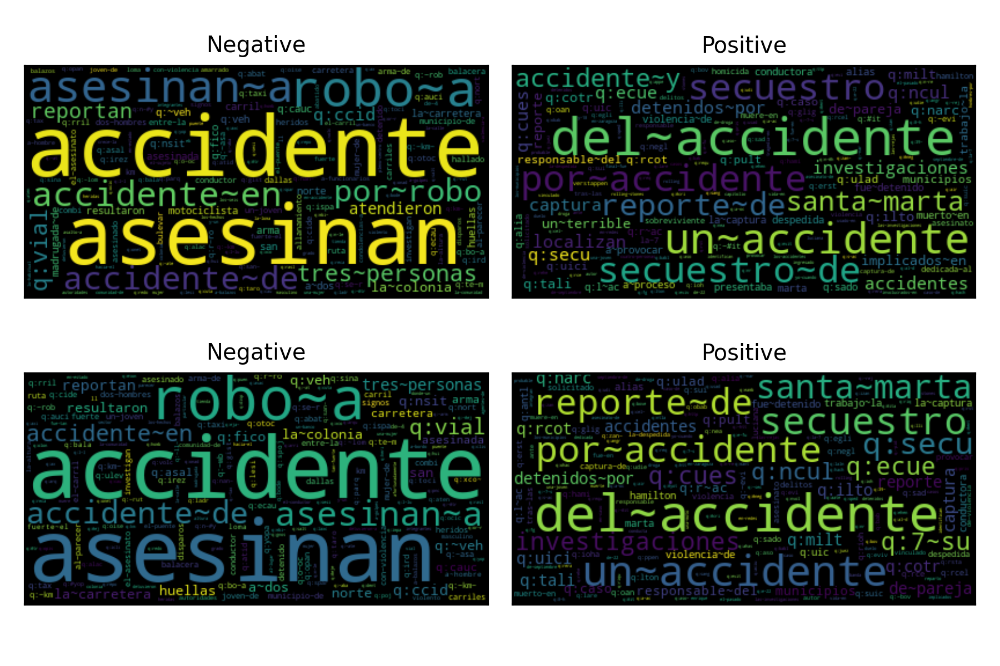
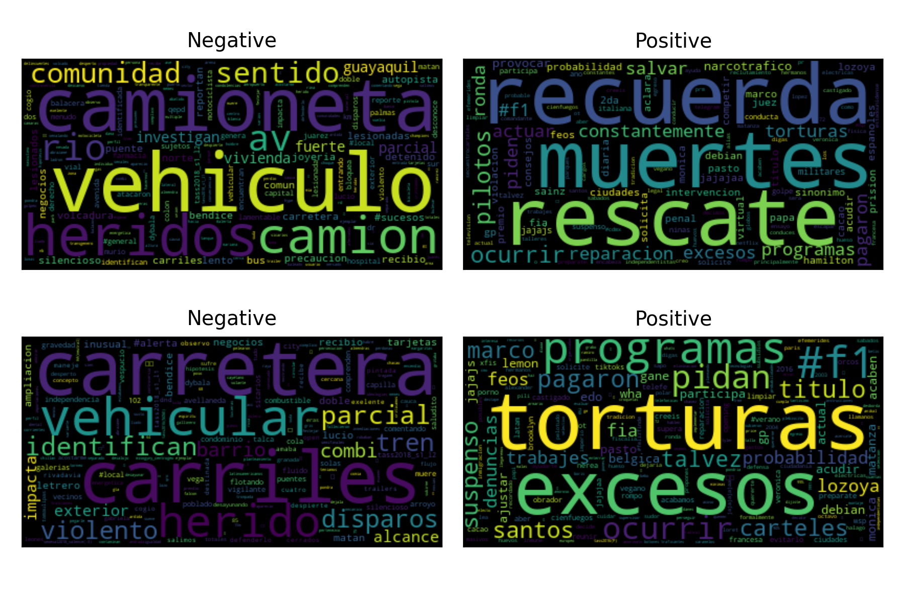

.. _davincis:

=============================================================================================================================================================================
`Detection of Aggressive and Violent Incidents from Social Media in Spanish (DA-VINCIS) <http://journal.sepln.org/sepln/ojs/ojs/index.php/pln/article/view/6565>`_
=============================================================================================================================================================================

The `DA-VINCIS <http://journal.sepln.org/sepln/ojs/ojs/index.php/pln/article/view/6565>`_ task (`webpage <https://sites.google.com/view/davincis-iberlef-2023>`_) presented at IberLEF 2023 focused on detecting violent events in social networks. The track has two tasks: the first was to detect texts indicating violent incidents, and the second was a multiclass problem where the categories correspond to different violent incidents. 

The following table presents the performance, in terms of :math:`f_1` score, for the different systems tested for the polarity task. The performance was estimated using stratified k-fold (:math:`k=5`) cross-validation. 

It can be observed that the best configuration corresponds to a Stack Generalization using two :py:class:`~EvoMSA.text_repr.BoW` systems and two :py:class:`~EvoMSA.text_repr.DenseBoW` as its base classifier. It is statistically equivalent to different configurations; however, the system submitted was the one with the best performance in the table. 

The following code can generate an instance of the system used in the competition. It must be noted that one needs to supply the training set because the method :py:attr:`~EvoMSA.competitions.Comp2023.stack_2_bow_tailored_all_keywords` performs a feature selection algorithm. 

.. code-block:: python

  >>> from EvoMSA.competitions import Comp2023
  >>> import numpy as np
  >>> D = # Training set
  >>> tailored = 'IberLEF2023_DAVINCIS_task1'
  >>> comp2023 = Comp2023(lang='es', 
                          tailored=tailored)
  >>> ins = comp2023.stack_2_bow_tailored_all_keywords(D)

.. list-table:: Performance (:math:`f_1`) in k-fold cross-validation.
    :header-rows: 1

    * - Configuration
      - Performance
      - p-value
    * - :py:func:`Comp2023.stack_2_bow_tailored_all_keywords`
      - 0.8984
      - 1.0000
    * - :py:func:`Comp2023.stack_3_bows_tailored_keywords`
      - 0.8971
      - 0.2260
    * - :py:func:`Comp2023.stack_3_bow_tailored_all_keywords`
      - 0.8968
      - 0.2120
    * - :py:func:`Comp2023.stack_2_bow_tailored_keywords`
      - 0.8966
      - 0.1580
    * - :py:func:`Comp2023.stack_2_bow_keywords`
      - 0.8955
      - 0.0540
    * - :py:func:`Comp2023.stack_2_bow_all_keywords`
      - 0.8951
      - 0.0440
    * - :py:func:`Comp2023.stack_3_bows`
      - 0.8931
      - 0.0760
    * - :py:func:`Comp2023.bow_voc_selection`
      - 0.8907
      - 0.0260
    * - :py:func:`Comp2023.bow`
      - 0.8894
      - 0.0180
    * - :py:func:`Comp2023.bow_training_set`
      - 0.8892
      - 0.0060
    * - :py:func:`Comp2023.stack_bows`
      - 0.8879
      - 0.0020
    * - :py:func:`Comp2023.stack_bow_keywords_emojis`
      - 0.8863
      - 0.0000
    * - :py:func:`Comp2023.stack_bow_keywords_emojis_voc_selection`
      - 0.8859
      - 0.0000

The system is composed of four base text classifiers. A procedure to visualize the behavior of the classifier is to generate a word cloud where the size of the tokens indicates their discriminant capacity. 

The following figure presents the word clouds generated for the two :py:class:`~EvoMSA.text_repr.BoW` systems. The difference between these systems is the vocabulary; the first uses the default vocabulary, and the second uses `voc_selection='most_common'`. The first row presents the word cloud corresponding to the first :py:class:`~EvoMSA.text_repr.BoW` text classifier, and the second row corresponds to the second text classifier. It is not evident to find the difference between the two models; this indicates that the difference must be in the tail of the distribution. 

The following table presents the performance of these systems; it can be observed that the systems have a similar performance.

.. list-table:: Performance of :py:class:`~EvoMSA.text_repr.BoW` systems
    :header-rows: 1

    * - Configuration
      - Recall
      - Precision
      - :math:`f_1`
    * - Default
      - 0.8677
      - 0.9023
      - 0.8846
    * - `voc_selection='most_common'`
      - 0.8692
      - 0.901
      - 0.8848

The following figure complements the description by presenting the word cloud of the :py:class:`~EvoMSA.text_repr.DenseBoW` systems. The difference between these systems is that the first one uses the default vocabulary, and as dense models, it includes representations where the predicted keyword was taken from the training set of the competition, i.e., these are tailored keywords. The second :py:class:`~EvoMSA.text_repr.DenseBoW` uses as vocabulary `voc_selection='most_common'`, and the default dense models. 

The first row of the figure presents the word cloud corresponding to the tailored keywords, and the second row presents the clouds for the second model. It can be observed from the figure that the more discriminant features are different in the word cloud shown in the first row against the counterpart of the second row. 

The following table presents the performance of these systems; it can be observed that the systems have a similar performance to the :py:class:`~EvoMSA.text_repr.BoW` systems. The only system with a lower performance is the :py:class:`~EvoMSA.text_repr.DenseBoW` with `voc_selection='most_common'`, which can be observed in the :math:`f_1` score.

.. list-table:: Performance of :py:class:`~EvoMSA.text_repr.DenseBoW` systems
    :header-rows: 1

    * - Configuration
      - Recall
      - Precision
      - :math:`f_1`
    * - Tailored Keywords
      - 0.8724
      - 0.902
      - 0.8869
    * - `voc_selection='most_common'`
      - 0.8708
      - 0.8882
      - 0.8794

.. _davincis-2022:

==================================================================================================================================================================================
`Detection of Aggressive and Violent Incidents from Social Media in Spanish (DA-VINCIS 2022) <http://journal.sepln.org/sepln/ojs/ojs/index.php/pln/article/view/6441>`_
==================================================================================================================================================================================

.. list-table:: Performance (:math:`f_1`) in k-fold cross-validation.
    :header-rows: 1

    * - Configuration
      - Performance
      - p-value
    * - :py:func:`Comp2023.stack_2_bow_all_keywords`
      - 0.8447
      - 1.0000
    * - :py:func:`Comp2023.stack_2_bow_tailored_all_keywords`
      - 0.8361
      - 0.0000
    * - :py:func:`Comp2023.stack_3_bow_tailored_all_keywords`
      - 0.8219
      - 0.0000
    * - :py:func:`Comp2023.stack_bow_keywords_emojis`
      - 0.7595
      - 0.0000
    * - :py:func:`Comp2023.stack_bow_keywords_emojis_voc_selection`
      - 0.7588
      - 0.0000
    * - :py:func:`Comp2023.stack_2_bow_tailored_keywords`
      - 0.7572
      - 0.0000
    * - :py:func:`Comp2023.stack_3_bows_tailored_keywords`
      - 0.7555
      - 0.0000
    * - :py:func:`Comp2023.stack_2_bow_keywords`
      - 0.7525
      - 0.0000
    * - :py:func:`Comp2023.bow_voc_selection`
      - 0.7342
      - 0.0000
    * - :py:func:`Comp2023.bow_training_set`
      - 0.7337
      - 0.0000
    * - :py:func:`Comp2023.stack_bows`
      - 0.7329
      - 0.0000
    * - :py:func:`Comp2023.stack_3_bows`
      - 0.7329
      - 0.0000
    * - :py:func:`Comp2023.bow`
      - 0.7324
      - 0.0000
