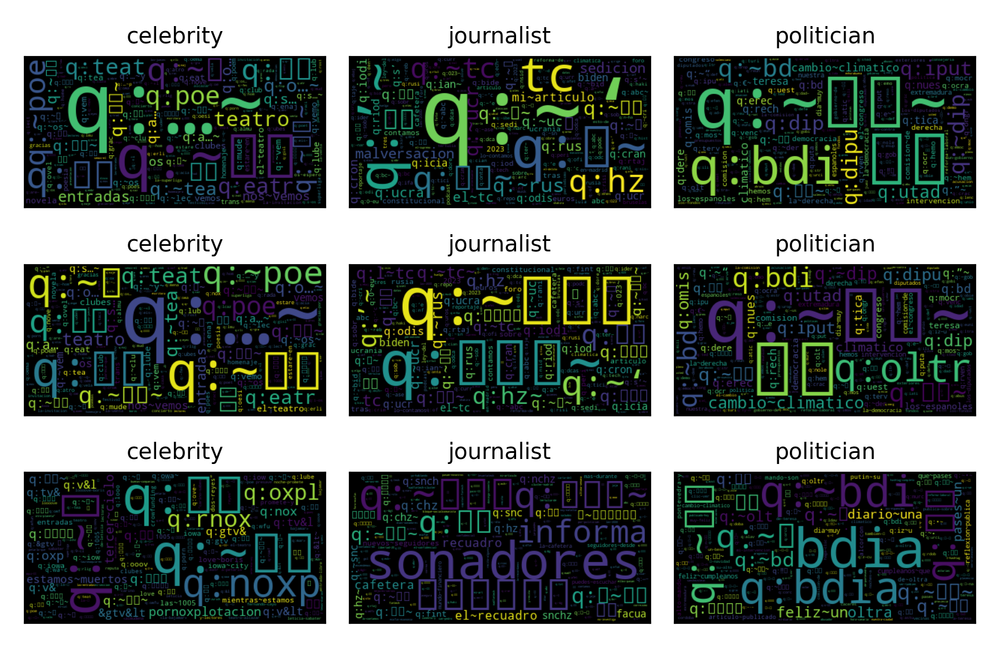

.. _politicses:

=============================================================================================================================
`Political Ideology Detection in Spanish Texts (PoliticEs) <https://codalab.lisn.upsaclay.fr/competitions/10173>`_
=============================================================================================================================

The `PoliticEs <http://journal.sepln.org/sepln/ojs/ojs/index.php/pln/article/view/6570>`_ task presented at IberLEF 2023 focused on extracting political ideology and demographic characteristics such as gender and profession. 

The following code can generate an instance of the system used in the competition. The system comprises three :py:class:`~EvoMSA.text_repr.BoW` systems. The first one usses the default parameters, the second uses the vocabulary specified in the parameter `voc_selection='most_common'`, and the third is trained on the competition training set. 

.. code-block:: python

  >>> from EvoMSA.competitions import Comp2023
  >>> comp2023 = Comp2023(lang='es')
  >>> ins = comp2023.stack_3_bows()

Gender Task
---------------------

The performance of the systems tested is presented in the following table. The performance is measured on the development set given in the competition. It can be observed that the system :py:func:`Comp2023.bow_training_set` obtained the best performance; however, the best performance in the three remaining tasks was obtained by the second best system, i.e., :py:func:`Comp2023.stack_3_bows`, therefore it was decided to submit the predictions of the latter system. 

.. list-table:: Performance (macro-:math:`f_1`) obtained on the task **Gender** in the developement set.
    :header-rows: 1

    * - Configuration
      - Performance
      - p-value
    * - :py:func:`Comp2023.bow_training_set`
      - 1.0000
      - 1.0000
    * - :py:func:`Comp2023.stack_3_bows`
      - 0.9764
      - 0.1080
    * - :py:func:`Comp2023.stack_3_bows_tailored_keywords`
      - 0.9643
      - 0.0660
    * - :py:func:`Comp2023.stack_3_bow_tailored_all_keywords`
      - 0.9643
      - 0.0660
    * - :py:func:`Comp2023.stack_bows`
      - 0.9406
      - 0.0200
    * - :py:func:`Comp2023.stack_2_bow_keywords`
      - 0.9406
      - 0.0200
    * - :py:func:`Comp2023.stack_2_bow_tailored_keywords`
      - 0.9406
      - 0.0200
    * - :py:func:`Comp2023.stack_2_bow_all_keywords`
      - 0.9406
      - 0.0200
    * - :py:func:`Comp2023.stack_2_bow_tailored_all_keywords`
      - 0.9406
      - 0.0200
    * - :py:func:`Comp2023.bow`
      - 0.9398
      - 0.0320
    * - :py:func:`Comp2023.bow_voc_selection`
      - 0.9398
      - 0.0320
    * - :py:func:`Comp2023.stack_bow_keywords_emojis`
      - 0.9291
      - 0.0180
    * - :py:func:`Comp2023.stack_bow_keywords_emojis_voc_selection`
      - 0.9291
      - 0.0180

A procedure to visualize the behavior of a :py:class:`~EvoMSA.text_repr.BoW` system is to generate a word cloud where the size of the tokens indicates their discriminant capacity. The following figure presents the generated word cloud for each text classifier composing the stacking approach. 

The following table presents the performance of these systems; it can be observed that the systems have a similar performance.

.. list-table:: Performance (macro-:math:`f_1`) of :py:class:`~EvoMSA.text_repr.BoW` systems and :py:class:`~EvoMSA.text_repr.StackGeneralization` on the competition test set.
    :header-rows: 1

    * - Configuration
      - Recall (female)
      - Recall (male)
      - Precision (female)
      - Precision (male)
      - macro-:math:`f_1`
    * - Default
      - 0.5422
      - 0.8609
      - 0.6294
      - 0.8119
      - 0.7091
    * - `voc_selection='most_common'`
      - 0.5422
      - 0.8583
      - 0.625
      - 0.8114
      - 0.7074
    * - `pretrain=False`
      - 0.512
      - 0.8976
      - 0.6855
      - 0.8085
      - 0.7185
    * - :py:class:`~EvoMSA.text_repr.StackGeneralization`
      - 0.6988
      - 0.7585
      - 0.5577
      - 0.8525
      - 0.7115

Profession Task
---------------------

.. list-table:: Performance in Cross-validation (Profession)
    :header-rows: 1

    * - Configuration
      - Performance
      - p-value
    * - :py:func:`Comp2023.stack_3_bows`
      - 1.0000
      - 1.0000
    * - :py:func:`Comp2023.bow_training_set`
      - 1.0000
      - 1.0000
    * - :py:func:`Comp2023.stack_3_bows_tailored_keywords`
      - 1.0000
      - 1.0000
    * - :py:func:`Comp2023.stack_3_bow_tailored_all_keywords`
      - 1.0000
      - 1.0000
    * - :py:func:`Comp2023.bow`
      - 0.9756
      - 0.0680
    * - :py:func:`Comp2023.bow_voc_selection`
      - 0.9756
      - 0.0680
    * - :py:func:`Comp2023.stack_bows`
      - 0.9597
      - 0.1920
    * - :py:func:`Comp2023.stack_bow_keywords_emojis`
      - 0.9352
      - 0.1000
    * - :py:func:`Comp2023.stack_bow_keywords_emojis_voc_selection`
      - 0.9352
      - 0.1000
    * - :py:func:`Comp2023.stack_2_bow_keywords`
      - 0.9105
      - 0.0920
    * - :py:func:`Comp2023.stack_2_bow_all_keywords`
      - 0.9105
      - 0.0920
    * - :py:func:`Comp2023.stack_2_bow_tailored_keywords`
      - 0.9022
      - 0.0880
    * - :py:func:`Comp2023.stack_2_bow_tailored_all_keywords`
      - 0.9022
      - 0.0880

.. list-table:: Performance of :py:class:`~EvoMSA.text_repr.BoW` systems and :py:class:`~EvoMSA.text_repr.StackGeneralization`
    :header-rows: 1

    * - Configuration
      - Recall (celebrity)
      - Recall (journalist)
      - Recall (politician)
      - Precision (celebrity)
      - Precision (journalist)
      - Precision (politician)
      - macro-:math:`f_1`
    * - Default
      - 0.1607
      - 0.9836
      - 0.8333
      - 0.8182
      - 0.8   
      - 0.9627
      - 0.6815
    * - `voc_selection='most_common'`
      - 0.1607
      - 0.9836
      - 0.8333
      - 0.8182
      - 0.8   
      - 0.9627
      - 0.6815
    * - `pretrain=False`
      - 0.0714
      - 0.9967
      - 0.8548
      - 1.0   
      - 0.7937
      - 0.9938
      - 0.6454
    * - :py:class:`~EvoMSA.text_repr.StackGeneralization`
      - 0.6607
      - 0.9344
      - 0.914 
      - 0.6491
      - 0.9105
      - 0.9605
      - 0.8379   

Ideology (Binary) Task
--------------------------

.. list-table:: Performance in Cross-validation (Ideology Binary)
    :header-rows: 1

    * - Configuration
      - Performance
      - p-value
    * - :py:func:`Comp2023.stack_3_bows`
      - 1.0000
      - 1.0000
    * - :py:func:`Comp2023.bow_training_set`
      - 1.0000
      - 1.0000
    * - :py:func:`Comp2023.stack_3_bows_tailored_keywords`
      - 1.0000
      - 1.0000
    * - :py:func:`Comp2023.stack_3_bow_tailored_all_keywords`
      - 1.0000
      - 1.0000
    * - :py:func:`Comp2023.stack_bow_keywords_emojis_voc_selection`
      - 0.9657
      - 0.0740
    * - :py:func:`Comp2023.stack_2_bow_keywords`
      - 0.9657
      - 0.0760
    * - :py:func:`Comp2023.stack_2_bow_tailored_keywords`
      - 0.9657
      - 0.0760
    * - :py:func:`Comp2023.stack_2_bow_all_keywords`
      - 0.9657
      - 0.0760
    * - :py:func:`Comp2023.stack_2_bow_tailored_all_keywords`
      - 0.9657
      - 0.0760
    * - :py:func:`Comp2023.bow`
      - 0.9545
      - 0.0420
    * - :py:func:`Comp2023.bow_voc_selection`
      - 0.9545
      - 0.0420
    * - :py:func:`Comp2023.stack_bows`
      - 0.9545
      - 0.0420
    * - :py:func:`Comp2023.stack_bow_keywords_emojis`
      - 0.9541
      - 0.0620

The following table presents the performance of these systems; it can be observed that the systems have a similar performance.

.. list-table:: Performance of :py:class:`~EvoMSA.text_repr.BoW` systems and :py:class:`~EvoMSA.text_repr.StackGeneralization`
    :header-rows: 1

    * - Configuration
      - Recall (left)
      - Recall (right)
      - Precision (left)
      - Precision (right)
      - macro-:math:`f_1`
    * - Default
      - 0.9541
      - 0.7773
      - 0.8643
      - 0.9194
      - 0.8747
    * - `voc_selection='most_common'`
      - 0.948 
      - 0.7773
      - 0.8635
      - 0.9096
      - 0.871 
    * - `pretrain=False`
      - 0.9786 
      - 0.7227
      - 0.8399
      - 0.9578
      - 0.8639
    * - :py:class:`~EvoMSA.text_repr.StackGeneralization`
      - 0.9511
      - 0.8182
      - 0.886 
      - 0.9184
      - 0.8914

Ideology (Multiclass) Task
-----------------------------

.. list-table:: Performance in Cross-validation (Ideology Multiclass)
    :header-rows: 1

    * - Configuration
      - Performance
      - p-value
    * - :py:func:`Comp2023.stack_3_bows`
      - 1.0000
      - 1.0000
    * - :py:func:`Comp2023.bow_training_set`
      - 1.0000
      - 1.0000
    * - :py:func:`Comp2023.stack_3_bows_tailored_keywords`
      - 0.9889
      - 0.1780
    * - :py:func:`Comp2023.stack_3_bow_tailored_all_keywords`
      - 0.9889
      - 0.1780
    * - :py:func:`Comp2023.bow`
      - 0.9644
      - 0.0400
    * - :py:func:`Comp2023.bow_voc_selection`
      - 0.9644
      - 0.0400
    * - :py:func:`Comp2023.stack_bows`
      - 0.9369
      - 0.0160
    * - :py:func:`Comp2023.stack_2_bow_keywords`
      - 0.9225
      - 0.0000
    * - :py:func:`Comp2023.stack_2_bow_all_keywords`
      - 0.9225
      - 0.0000
    * - :py:func:`Comp2023.stack_2_bow_tailored_keywords`
      - 0.9121
      - 0.0040
    * - :py:func:`Comp2023.stack_2_bow_tailored_all_keywords`
      - 0.9121
      - 0.0040
    * - :py:func:`Comp2023.stack_bow_keywords_emojis_voc_selection`
      - 0.8475
      - 0.0000
    * - :py:func:`Comp2023.stack_bow_keywords_emojis`
      - 0.8467
      - 0.0000

The following table presents the performance of these systems; it can be observed that the systems have a similar performance.

.. list-table:: Performance of :py:class:`~EvoMSA.text_repr.BoW` systems and :py:class:`~EvoMSA.text_repr.StackGeneralization`
    :header-rows: 1

    * - Configuration
      - Recall (left)
      - Recall (moderate left)
      - Recall (moderate right)
      - Recall (right)
      - Precision (left)
      - Precision (moderate left)
      - Precision (moderate right)
      - Precision (right)
      - macro-:math:`f_1`
    * - Default
      - 0.5299
      - 0.819 
      - 0.6797
      - 0.4627
      - 0.6813
      - 0.6442
      - 0.6753
      - 0.8857
      - 0.6507
    * - `voc_selection='most_common'`
      - 0.5299
      - 0.819 
      - 0.6797
      - 0.4627
      - 0.6813
      - 0.6466
      - 0.671 
      - 0.8857
      - 0.6505
    * - `pretrain=False`
      - 0.5214
      - 0.8619 
      - 0.7124
      - 0.2985
      - 0.8472
      - 0.6329
      - 0.6566
      - 0.8696
      - 0.6258
    * - :py:class:`~EvoMSA.text_repr.StackGeneralization`
      - 0.5897
      - 0.7381
      - 0.7255
      - 0.5522
      - 0.5847
      - 0.6798
      - 0.707 
      - 0.8409
      - 0.6694
