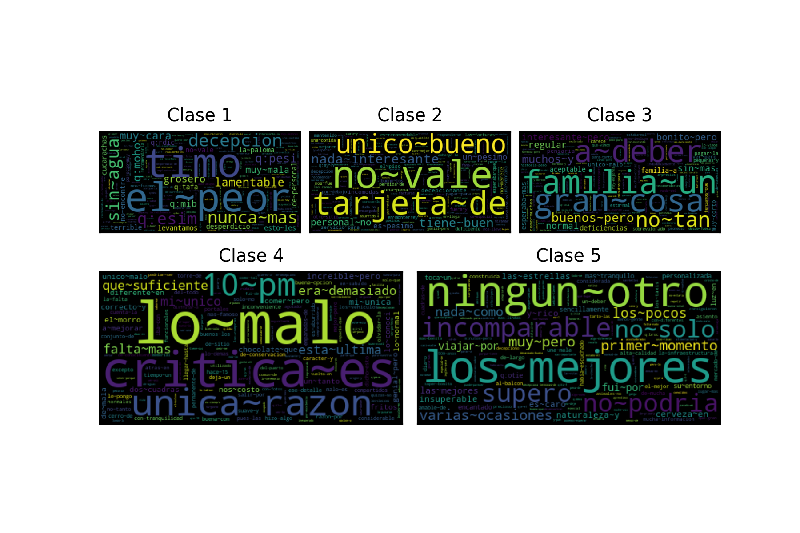
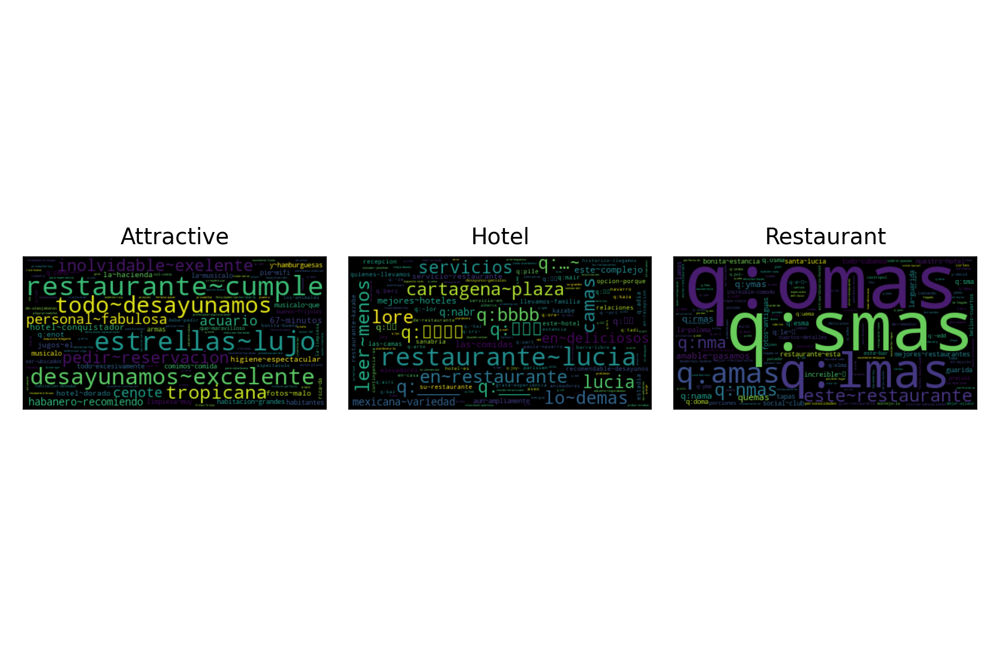
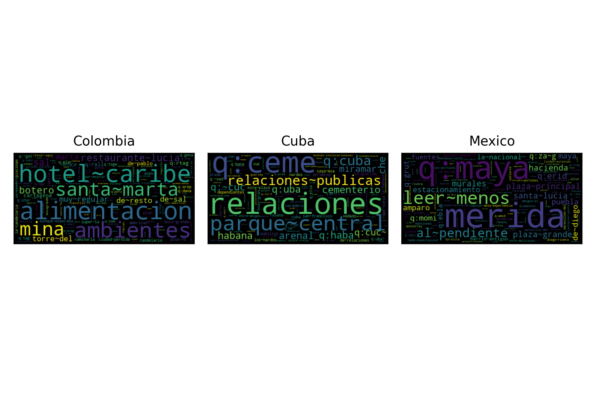

.. _restmex:

`Research on Sentiment Analysis Task for Mexican Tourist Texts (Rest-Mex) <https://sites.google.com/cimat.mx/rest-mex2023>`_
^^^^^^^^^^^^^^^^^^^^^^^^^^^^^^^^^^^^^^^^^^^^^^^^^^^^^^^^^^^^^^^^^^^^^^^^^^^^^^^^^^^^^^^^^^^^^^^^^^^^^^^^^^^^^^^^^^^^^^^^^^^^^^

The `Rest-Mex <http://journal.sepln.org/sepln/ojs/ojs/index.php/pln/article/view/6572>`_ task presented at IberLEF 2023 focused sentiment analysis and clustering on tourist texts; nonetheless, our participation was only on the sentiment analysis tasks. The first task consisted of identifying the polarity of the tourist text. The second task was to identify whether the visited place was either an attraction, hotel, or restaurant. The third and last task was identifying the country (i.e., Colombia, Cuba, and Mexico).

The following table presents the performance, in terms of macro-f1, for the different systems tested for the polarity task. It can be observed that the best configuration corresponds to a Stack Generalization using two :py:class:`~EvoMSA.text_repr.BoW` systems as its base classifier. It is statistically equivalent to Stacking Generalization using three :py:class:`~EvoMSA.text_repr.BoW`.

.. list-table:: Performance in Cross-validation (Polarity)
    :header-rows: 1

    * - Configuration
      - Performance
      - p-value
    * - :py:func:`Comp2023.stack_bows`
      - 0.5605
      - 1.0000
    * - :py:func:`Comp2023.stack_3_bows`
      - 0.5603
      - 0.4140
    * - :py:func:`Comp2023.stack_3_bows_tailored_keywords`
      - 0.5472
      - 0.0000
    * - :py:func:`Comp2023.stack_3_bow_tailored_all_keywords`
      - 0.5467
      - 0.0000
    * - :py:func:`Comp2023.stack_2_bow_tailored_keywords`
      - 0.5448
      - 0.0000
    * - :py:func:`Comp2023.stack_2_bow_tailored_all_keywords`
      - 0.5446
      - 0.0000
    * - :py:func:`Comp2023.stack_2_bow_all_keywords`
      - 0.5431
      - 0.0000
    * - :py:func:`Comp2023.stack_2_bow_keywords`
      - 0.5420
      - 0.0000
    * - :py:func:`Comp2023.stack_bow_keywords_emojis_voc_selection`
      - 0.5346
      - 0.0000
    * - :py:func:`Comp2023.stack_bow_keywords_emojis`
      - 0.5310
      - 0.0000
    * - :py:func:`Comp2023.bow_training_set`
      - 0.5179
      - 0.0000
    * - :py:func:`Comp2023.bow`
      - 0.5167
      - 0.0000
    * - :py:func:`Comp2023.bow_voc_selection`
      - 0.5152
      - 0.0000

The following figure presents a word cloud with the most discriminative tokens for each class in the polarity task. 

.. list-table:: Performance in Cross-validation (Type)
    :header-rows: 1

    * - Configuration
      - Performance
      - p-value
    * - :py:func:`Comp2023.bow_training_set`
      - 0.9802
      - 1.0000
    * - :py:func:`Comp2023.bow`
      - 0.9793
      - 0.0040
    * - :py:func:`Comp2023.stack_3_bows`
      - 0.9793
      - 0.0000
    * - :py:func:`Comp2023.bow_voc_selection`
      - 0.9792
      - 0.0000
    * - :py:func:`Comp2023.stack_3_bow_tailored_all_keywords`
      - 0.9783
      - 0.0000
    * - :py:func:`Comp2023.stack_3_bows_tailored_keywords`
      - 0.9783
      - 0.0000
    * - :py:func:`Comp2023.stack_bows`
      - 0.9782
      - 0.0000
    * - :py:func:`Comp2023.stack_2_bow_tailored_keywords`
      - 0.9773
      - 0.0000
    * - :py:func:`Comp2023.stack_2_bow_tailored_all_keywords`
      - 0.9773
      - 0.0000
    * - :py:func:`Comp2023.stack_2_bow_keywords`
      - 0.9769
      - 0.0000
    * - :py:func:`Comp2023.stack_2_bow_all_keywords`
      - 0.9768
      - 0.0000
    * - :py:func:`Comp2023.stack_bow_keywords_emojis`
      - 0.9743
      - 0.0000
    * - :py:func:`Comp2023.stack_bow_keywords_emojis_voc_selection`
      - 0.9742
      - 0.0000

The following figure presents a word cloud with the most discriminative tokens for each class in the type task. 

.. list-table:: Performance in Cross-validation (Country)
    :header-rows: 1

    * - Configuration
      - Performance
      - p-value
    * - :py:func:`Comp2023.bow_training_set`
      - 0.9260
      - 1.0000
    * - :py:func:`Comp2023.stack_3_bows`
      - 0.9225
      - 0.0000
    * - :py:func:`Comp2023.bow_voc_selection`
      - 0.9200
      - 0.0000
    * - :py:func:`Comp2023.bow`
      - 0.9194
      - 0.0000
    * - :py:func:`Comp2023.stack_bows`
      - 0.9167
      - 0.0000
    * - :py:func:`Comp2023.stack_3_bow_tailored_all_keywords`
      - 0.9166
      - 0.0000
    * - :py:func:`Comp2023.stack_3_bows_tailored_keywords`
      - 0.9164
      - 0.0000
    * - :py:func:`Comp2023.stack_2_bow_tailored_all_keywords`
      - 0.9101
      - 0.0000
    * - :py:func:`Comp2023.stack_2_bow_tailored_keywords`
      - 0.9097
      - 0.0000
    * - :py:func:`Comp2023.stack_2_bow_keywords`
      - 0.9076
      - 0.0000
    * - :py:func:`Comp2023.stack_2_bow_all_keywords`
      - 0.9076
      - 0.0000
    * - :py:func:`Comp2023.stack_bow_keywords_emojis`
      - 0.8951
      - 0.0000
    * - :py:func:`Comp2023.stack_bow_keywords_emojis_voc_selection`
      - 0.8949
      - 0.0000

The following figure presents a word cloud with the most discriminative tokens for each class in the country task. 

